# Mermaid Diagram Syntax Rules

## Quick Reference
- **NEVER** use `@` symbols in node text (e.g., `@claude`, `@username`)
- **NEVER** use curly braces `{variable}` in node text
- **ALWAYS** use `<br/>` for line breaks in nodes, never pipe `|`
- **ALWAYS** validate diagrams locally before committing
- **Emojis are FINE** - ✅ and ❌ work perfectly in Mermaid

## Core Principles

### 1. Special Characters to Avoid in Node Text

#### @ Symbols (CRITICAL)
The `@` symbol is a special character in Mermaid and causes parsing errors when used in node text.

**❌ BAD:**
```mermaid
graph TD
    A[@claude mention detected] --> B[Process request]
    C[Email: user@example.com] --> D[Validate]
```

**✅ GOOD:**


#### Curly Braces in Text
Curly braces `{}` are used to define decision nodes in Mermaid. Using them inside text causes parsing conflicts.

**❌ BAD:**
```mermaid
graph TD
    A{API Call: GET /users/{username}}
    B[Process {variable} here]
```

**✅ GOOD:**


**Note:** Use uppercase placeholder names like `USERNAME`, `VARIABLE`, `ID` instead of curly braces.

#### Pipe Characters for Line Breaks
The pipe character `|` has special meaning in Mermaid. Use HTML `<br/>` tags for line breaks instead.

**❌ BAD:**
```mermaid
graph TD
    A{Can you see|your username?}
    B{API Call:|GET /endpoint}
```

**✅ GOOD:**


### 2. What IS Safe to Use

#### Emojis
Emojis work perfectly in Mermaid diagrams! Use them for visual clarity.

**✅ SAFE:**


```mermaid
graph TD
    A[User Login] --> B{Authorized?}
    B -->|Yes| C[✅ Access Granted]
    B -->|No| D[❌ Access Denied]
    E[Membership Public ✅]
    F[⚠️ Warning State]
```

#### Standard Text and Symbols
Most standard characters, punctuation, and formatting work fine:

**✅ SAFE:**
```mermaid
graph TD
    A[User: John Doe] --> B[Email: john.doe-example.com]
    C[Status: Active (verified)] --> D[Next Step]
    E[Version: v1.0.0] --> F[API Endpoint]
```

### 3. Common Patterns to Follow

#### Decision Nodes


#### Sequence Diagrams (@ is allowed in messages)
In sequence diagrams, `@` in messages is typically fine:

**✅ SAFE:**


#### Edge Labels
Use `-->|label|` for edge labels with special characters:


## Validation Workflow

### Before Committing

Always run the validation script before committing Mermaid diagram changes:

```bash
./scripts/validate-mermaid.sh docs/path/to/file.md
```

### What the Validator Checks

1. **@ symbols** in node text (except in sequence diagrams)
2. **Curly braces** like `{variable}` in node text
3. **Pipe characters** used for line breaks (suggests `<br/>` instead)

### Expected Output

**✅ Success:**
```
🔍 Validating Mermaid diagrams in: docs/example.md

Checking for @ symbols...
✅ No problematic @ symbols found

Checking for curly braces in node text...
✅ No problematic curly braces found

Checking for pipe characters used for line breaks...
✅ No problematic pipe characters found

✅ All Mermaid diagrams passed validation!
```

**❌ Failure:**
```
❌ Found @ symbols in Mermaid node text:
  Line 42: A[@claude detected] --> B[Process]

Common fixes:
  - Replace '@claude' with 'Claude'
  - Replace '{username}' with 'USERNAME'
  - Replace '|' with '<br/>' for line breaks in nodes
```

## Common Replacements

### Variables and Placeholders
- `{username}` → `USERNAME`
- `{id}` → `ID`
- `{userId}` → `USER_ID`
- `{variable}` → `VARIABLE`
- `{parameter}` → `PARAMETER`

### Mentions and References
- `@claude` → `Claude`
- `@user` → `user`
- `@username` → `username`
- `user@example.com` → `user at example.com`

### Line Breaks
- `Text|More text` → `Text<br/>More text`
- `Line 1|Line 2` → `Line 1<br/>Line 2`
- `API:|GET /endpoint` → `API:<br/>GET /endpoint`

## GitHub Rendering

### Testing Before Push

GitHub's Mermaid renderer is strict. These issues will cause "Unable to render rich display" errors:

1. `@` symbols in node text
2. Curly braces in node text (outside decision node definition)
3. Pipe characters for line breaks in decision nodes

### Local Validation Benefits

- Catches errors before committing
- Keeps git history clean (no fix-up commits)
- Provides immediate feedback with line numbers
- Suggests correct replacements

## Error Messages You Might See

### GitHub Error
```
Unable to render rich display

Parse error on line X:
...text with @symbol...
----------------------^
Expecting 'SYMBOL', 'TEXT', got 'SPECIAL_CHAR'
```

**Solution:** Use the validation script to find and fix the issue.

### Common Parse Errors

1. **"Expecting 'TEXT', got '@'"**
   - Fix: Remove @ symbols from node text

2. **"Non-terminated regular expression"**
   - Fix: Replace curly braces with plain text

3. **"Unexpected token '|'"**
   - Fix: Use `<br/>` instead of pipe for line breaks

## Best Practices

### ✅ Do

1. **Use semantic names**: `[User Authentication]`, `[API Response]`
2. **Use emojis for status**: `✅ Success`, `❌ Failed`, `⚠️ Warning`
3. **Use HTML breaks**: `<br/>` for multi-line text in nodes
4. **Use uppercase placeholders**: `USERNAME`, `USER_ID`, `VARIABLE`
5. **Validate before commit**: Run `./scripts/validate-mermaid.sh`
6. **Test complex diagrams**: For large diagrams, validate frequently

### ❌ Don't

1. **Don't use @ in node text**: Replace with plain text
2. **Don't use {} for variables**: Use uppercase placeholders
3. **Don't use | for line breaks**: Use `<br/>` instead
4. **Don't skip validation**: Always check before pushing
5. **Don't commit without testing**: GitHub rendering is strict
6. **Don't assume emojis are the problem**: They work fine!

## Examples

### Complete Working Example

```mermaid
graph TD
    A[User mentions Claude] --> B[GitHub Action Triggered]
    B --> C[Extract username from event]
    C --> D[Organization Membership Check]
    
    D --> E{GitHub API:<br/>GET /orgs/dotCMS/members/USERNAME}
    
    E -->|HTTP 204| F[✅ Member Verified]
    E -->|HTTP 404| G[❌ Access Denied]
    
    F --> H[Continue Claude Workflow]
    G --> I[Display Error & Troubleshooting]
    
    subgraph "Security Features"
        J[Hardcoded Organization: dotCMS]
        K[No Additional Secrets Required]
        L[Detects Public & Private Members]
        M[Graceful Error Messages]
    end
    
    style F fill:#c8e6c9
    style G fill:#ffcdd2
    style H fill:#c8e6c9
    style I fill:#ffcdd2
```



### Sequence Diagram Example


## Troubleshooting

### Diagram Won't Render on GitHub

1. **Run validation script:**
   ```bash
   ./scripts/validate-mermaid.sh path/to/file.md
   ```

2. **Check for common issues:**
   - Search for `@` in node text: `grep -n "@[a-zA-Z]" file.md`
   - Search for `{variable}`: `grep -n "{[a-zA-Z]" file.md`
   - Search for pipe breaks: Look for `|` in decision nodes

3. **Fix and revalidate:**
   - Apply suggested fixes
   - Run validator again
   - Commit only when validation passes

### Script Execution Issues

If the validation script fails to run:

```bash
# Make it executable
chmod +x scripts/validate-mermaid.sh

# Run with bash explicitly
bash scripts/validate-mermaid.sh file.md
```

## Integration with Development Workflow

### Pre-Commit Hook (Optional)

Add to `.git/hooks/pre-commit`:

```bash
#!/bin/bash

# Validate Mermaid diagrams in staged .md files
STAGED_MD=$(git diff --cached --name-only --diff-filter=ACM | grep "\.md$")

if [ -n "$STAGED_MD" ]; then
    for file in $STAGED_MD; do
        if grep -q "```mermaid" "$file"; then
            echo "Validating Mermaid diagrams in $file..."
            ./scripts/validate-mermaid.sh "$file" || exit 1
        fi
    done
fi
```

### CI/CD Integration

Add to GitHub Actions workflow:

```yaml
- name: Validate Mermaid Diagrams
  run: |
    for file in $(find docs -name "*.md"); do
      if grep -q '```mermaid' "$file"; then
        ./scripts/validate-mermaid.sh "$file"
      fi
    done
```

## Related Rules
- **Documentation Maintenance**: See `documentation-maintenance.md` for doc standards
- **Development Patterns**: See `development-patterns.md` for quality practices
- **Thoughtful Execution**: See `thoughtful-execution.md` for validation workflow

---

**Last Updated**: October 2025
**Validation Script**: `scripts/validate-mermaid.sh`
**Applies To**: All Markdown files with Mermaid diagrams

