# GitHub Workflows & Actions Architecture

This document provides a comprehensive overview of the dotCMS GitHub workflows and actions architecture, showing all relationships and dependencies.

## File Naming Convention

GitHub only allows workflows (including reusable workflows) to be placed in the `.github/workflows/` directory. Subfolders are ignored. To maintain organization with many files, we use a folder-like naming convention:

- **Hierarchy Separator**: Underscores (`_`) represent folder structure
  - Example: `cicd/comp/build-phase.yml` → `cicd_comp_build-phase.yml`

- **Numerical Prefixes**: Main CICD workflows use numbers to indicate PR progression order
  - Example: `cicd_1-pr.yml`, `cicd_2-merge-queue.yml`, etc.

- **Workflow Name Prefixes**: Use `-` prefix for top-level workflows (e.g., `-1 PR Check`)
  - This ensures they appear at the top of GitHub's alphabetically-sorted workflow list
  - Makes critical workflows easy to find in the UI

**Important Notes**:
- The exact names of the first job `"Initialize / Initialize"` and last job `"Finalize / Final Status"` are critical for PR and merge-queue workflows
- These job names indicate workflow start/completion to GitHub Checks
- Changing these names may cause checks to wait until timeout

## Quick Reference

### Main CICD Workflows (Entry Points)
1. **cicd_1-pr.yml** - PR checks (on PR open/sync)
2. **cicd_2-merge-queue.yml** - Merge queue validation
3. **cicd_3-trunk.yml** - Main branch builds (on push to main)
4. **cicd_4-nightly.yml** - Nightly builds (scheduled 3:18 AM)
5. **cicd_5-lts.yml** - LTS branch testing (on push to release-*)
6. **cicd_6-release.yml** - Release process (manual trigger)

### Common Phase Pattern
All main CICD workflows follow this pattern:
```
Initialize → Build → Test → Semgrep → CLI Build → Deployment → Release → Finalize → Report
```

## Architecture Diagram

This simplified diagram shows the high-level architecture. See [Workflow Dependency Matrix](#workflow-dependency-matrix) for detailed phase usage by each workflow.

```mermaid
graph TB
    %% Triggers Layer
    subgraph Triggers[" "]
        direction LR
        TTitle["🎯 Workflow Triggers"]
        T1[PR Events]
        T2[Push to Main]
        T2b[Push to release-*]
        T3[Scheduled]
        T4[Manual]
        T5[Issue Events]
    end

    %% Main CICD Workflows Layer
    subgraph MainCICD[" "]
        direction LR
        WTitle["🚀 Main CICD Workflows"]
        W1[1-PR Check]
        W2[2-Merge Queue]
        W3[3-Trunk]
        W4[4-Nightly]
        W5[5-LTS]
        W6[6-Release]
    end
    
    WNote["All follow standard pattern: Initialize → Build → Test → Deploy → Finalize"]

    %% Reusable Phases Layer
    subgraph Phases[" "]
        direction LR
        PTitle["⚙️ Reusable Phase Workflows"]
        PhaseList["10 Phase Workflows:<br/>Initialize • Build • Test • Semgrep • CLI Build<br/>Deploy • Release Prepare • Release • Finalize • PR Notifier"]
    end

    %% Actions Layer
    subgraph Actions[" "]
        direction LR
        ATitle["🔧 Composite Actions"]
        A1["Core CICD:<br/>maven-job • setup-java<br/>prepare-runner • cleanup-runner"]
        A2["Deployment:<br/>deploy-docker • deploy-jfrog<br/>deploy-cli-npm • deploy-javadoc"]
        A3["Support:<br/>notify-slack • issue-fetcher<br/>issue-labeler • sbom-generator"]
    end

    %% Configuration Layer
    subgraph Config[" "]
        direction LR
        CTitle["📋 Configuration Files"]
        C1[test-matrix.yml • filters.yaml]
        C2[github-teams.json • slack-mappings.json]
    end

    %% Side: Issue Management
    subgraph Issues[" "]
        direction TB
        ITitle["🎫 Issue Management"]
        I1[PR Opened → Link Issue]
        I2[PR Merged → Update Issue]
        I3[Stale Issues Cleanup]
    end

    %% Vertical Flow - Main Pipeline
    Triggers --> MainCICD
    MainCICD --> WNote
    WNote --> Phases
    Phases --> Actions
    Actions --> Config
    
    %% Side Flows
    T5 -.->Issues
    W1 -.triggers after.-> Report[Post-Workflow<br/>Reporting]
    W2 -.triggers after.-> Report

    %% Specific trigger connections
    T1 -.->W1
    T1 -.->W2
    T2 -.->W3
    T2b -.->W5
    T3 -.->W4
    T4 -.->W6

    %% Note
    Config --> Note1["📌 See tables below for:<br/>• Which workflows use which phases<br/>• Detailed flow diagrams for each workflow<br/>• Complete action reference"]

    %% Styling
    classDef trigger fill:#e1f5ff,stroke:#01579b,stroke-width:2px
    classDef main fill:#fff3e0,stroke:#e65100,stroke-width:3px
    classDef phase fill:#e8f5e9,stroke:#2e7d32,stroke-width:2px
    classDef action fill:#e3f2fd,stroke:#1565c0,stroke-width:1px
    classDef config fill:#fff9c4,stroke:#f57f17,stroke-width:2px
    classDef issue fill:#fce4ec,stroke:#c2185b,stroke-width:2px
    classDef note fill:#f5f5f5,stroke:#666,stroke-width:1px,stroke-dasharray:5
    classDef title fill:#ffffff,stroke:none,font-weight:bold,font-size:14px

    class T1,T2,T3,T4,T5 trigger
    class W1,W2,W3,W4,W5,W6 main
    class PhaseList phase
    class A1,A2,A3 action
    class C1,C2 config
    class I1,I2,I3 issue
    class Report,Note1,WNote note
    class TTitle,WTitle,PTitle,ATitle,CTitle,ITitle title
```



### Architecture Layers Explained

**Layer 1: Triggers** → Events that start workflows (PR, push, schedule, manual)

**Layer 2: Main Workflows** → Top-level orchestrators (6 workflows)
- Each workflow composes different phase combinations
- Follow standard pattern: Initialize → Build → Test → Deploy → Finalize

**Layer 3: Reusable Phases** → Modular workflow components (10 phases)
- Single source of truth for each phase
- Used by multiple main workflows
- See [dependency matrix](#workflow-dependency-matrix) for usage

**Layer 4: Composite Actions** → Atomic operations (15+ actions)
- Low-level building blocks
- Called by phases
- Categories: Core CICD, Deployment, Support

**Layer 5: Configuration** → Data-driven behavior
- test-matrix.yml: Test suite definitions
- filters.yaml: Change detection rules
- JSON files: Team and Slack mappings

### Detailed Component Reference

For complete details on individual components:
- [Reusable Workflow Phases](#reusable-workflow-phases) - All 10 phase workflows with purposes
- [Custom Actions](#custom-actions) - All 15+ composite actions organized by category
- [Workflow Dependency Matrix](#workflow-dependency-matrix) - Which workflows use which phases
- [Detailed Flow Diagrams](#detailed-flow-diagrams) - Step-by-step flows for each workflow

## Workflow Configurations (Path to Main Branch)

Each top-level CICD workflow has specific triggers, purposes, and configuration optimizations:

| Workflow | Trigger | Purpose & Configuration |
|----------|---------|------------------------|
| **cicd_1-pr.yml** | Push of PR to GitHub | • **No secrets** - runs on unreviewed code<br/>• **Selective testing** - uses filters to skip unaffected tests<br/>• **Post-workflow reporting** - separate workflow handles secrets<br/>• **Filter-based** - `.github/filters.yaml` determines what runs |
| **cicd_2-merge-queue.yml** | PR added to merge queue | • **All tests** - catches flaky tests and filter issues<br/>• **Includes all PRs ahead** - tests combined code<br/>• **Same commit as main** - success means HEAD of main will be identical<br/>• **Critical monitoring** - failures here block all developers |
| **cicd_3-trunk.yml** | Push to main branch | • **Artifact reuse** - uses merge queue build artifacts<br/>• **Native CLI builds** - too expensive for every PR<br/>• **Snapshot deployments** - GitHub packages, Artifactory<br/>• **SDK publishing** - optional NPM package publishing |
| **cicd_4-nightly.yml** | Scheduled (3:18 AM daily) | • **Trunk health monitor** - fail-safe detection of breakage<br/>• **Prevents change accumulation** - catch issues before they pile up<br/>• **Critical for CI success** - enabled increased release frequency<br/>• **NOT a release gate** - legacy workflow for codebase quality<br/>• **Long-running tests** - tests too slow for PR workflow |
| **cicd_5-lts.yml** | Push to release-* branches | • **LTS validation** - tests for long-term support branches<br/>• **Full test suite** - comprehensive validation<br/>• **Version-specific** - uses hardcoded version in workflow |
| **cicd_6-release.yml** | Manual workflow_dispatch | • **Production release** - creates official releases<br/>• **Full deployment** - Artifactory, Docker, Javadocs<br/>• **Version management** - creates release branches and tags<br/>• **GitHub labels** - updates issue tracking labels |

### Development Philosophy

**Main Branch Releasability**: The main branch should always be in a releasable state. PR validation gates are the primary defense against unreleasable commits. This prevents development disruption when developers merge main into their branches.

**Trunk Health is Critical**: Maintaining a clean main branch has been crucial to CI success and increased release frequency. The nightly workflow serves as an early warning system:
- **Problem**: Issues accumulating on main make debugging exponentially harder
- **Solution**: Nightly tests catch trunk breakage within 24 hours
- **Result**: Fast identification and fixes prevent cascading issues
- **Impact**: Enabled dramatic increase in release frequency over recent years

**Progressive Promotion**: Before official release, commits undergo additional validation phases without blocking development:

```text
Developer PR → PR Check → Merge Queue → Main Branch → Manual QA/Smoke Testing → RC → Release
                                             ↓
                                      Nightly Tests
                                    (Trunk Health Monitor)
```

**Trunk Health vs Release Promotion:**

- **Nightly Tests**: Legacy workflow, NOT part of release promotion
  - **Purpose**: Early detection of trunk breakage
  - **Critical for**: Maintaining clean codebase, CI success, release frequency
  - **Why it matters**: Catches issues before changes accumulate (easier debugging)
  - **Result**: Has enabled increased release frequency over recent years

- **Manual QA/Smoke Testing**: Always required before RC
  - **Purpose**: Validation for release readiness
  - **Gate**: Must pass to promote to Release Candidate

## Release Promotion Process

### Version Promotion Flow

Commits are promoted from main to release through intermediate branches. Each promotion step increases confidence:

**Before Nightly Promotion:**
```text
nightly:    PR1A
             |
main:   --PR1---PR2---PR3---PR4
```

**After Nightly Promotion:**
```text
nightly:    PR1A--PR2B--PR3B--PR4B  (versioned with date)
             |     |     |     |
main:   --PR1---PR2---PR3---PR4
```

**Key Points:**
- Promotion creates new commits (different SHA) with version changes
- Only `.mvn/maven.config` is modified (deterministic, reproducible)
- Original SHA is preserved for traceability
- All commits between current HEAD and target are included (no cherry-picking)

### Example: PR to Release Flow

```text
x = promotion with version change

release         PR1a--PR2b--PR3b--PR4b--PR5b--PR6b
                 |x    |     |    |     |     |x
rc              PR1A--PR2B--PR3B--PR4B--PR5C--PR6C--PR7D
                 |x    |     |     |x    |     |x    |x
main    run: --PR1---PR2---PR3---PR4---PR5---PR6---PR7---PR8
```

**Timeline:**
1. PR1 promoted to RC-A → RC testing occurs
2. PR1A tested and approved → Release A (while PR2, PR3 added to main)
3. PR4 promoted to RC-B → PR4B tested (includes PR2B, PR3B, PR4B)
4. PR4B not approved (issue found)
5. PR6 (fix) promoted to RC-C
6. PR6C approved → Release C

**Notes:**
- RC versions can use `-rc` suffix or final version number
- If using final version in RC, deploy to staging (no rebuild on release)
- Versions can change on promotion or retain same version with internal build number
- No manual changes to promotion branches (only version config)
- Fixes flow through normal PR process

## Detailed Flow Diagrams

### 1. PR Check Workflow (cicd_1-pr.yml)


### 2. Release Workflow (cicd_6-release.yml)


### 3. Trunk Workflow (cicd_3-trunk.yml)

```mermaid
flowchart TD
    Start([Push to main]) --> Init[Initialize Phase]
    Init --> CheckReuse{Reuse<br/>Previous<br/>Build?}
    
    CheckReuse -->|No| Build[Build Phase]
    CheckReuse -->|Yes| CheckFound{Found<br/>Artifacts?}
    
    CheckFound -->|No & build-on-missing| Build
    CheckFound -->|Yes| Test
    CheckFound -->|No & !build-on-missing| Error([❌ Exit])
    
    Build --> Test[Test Phase]
    Test --> TestMatrix{Run All<br/>Tests?}
    
    TestMatrix -->|Yes| AllTests[All Test Suites]
    TestMatrix -->|No| ChangedTests[Changed Component Tests]
    
    AllTests --> Semgrep[Semgrep Phase]
    ChangedTests --> Semgrep
    
    Test --> BuildCLI[CLI Native Build Phase]
    Semgrep --> BuildCLI
    
    BuildCLI --> OSMatrix{Native<br/>Build<br/>Matrix}
    OSMatrix --> Linux[Linux x86_64]
    OSMatrix --> MacIntel[macOS Intel]
    OSMatrix --> MacSilicon[macOS Silicon]
    
    Linux --> Deploy[Deployment Phase]
    MacIntel --> Deploy
    MacSilicon --> Deploy
    
    Deploy --> DeployDocker[Docker Images]
    Deploy --> DeployCLI[CLI to JFrog]
    Deploy --> DeploySDK{Publish<br/>NPM SDKs?}
    
    DeploySDK -->|Yes| SDKPublish[NPM SDK Libs]
    DeploySDK -->|No| Finalize
    SDKPublish --> Finalize[Finalize Phase]
    
    Finalize --> Report[Post-Workflow<br/>Reporting]
    
    style Start fill:#4caf50
    style Error fill:#f44336
```



### 4. Test Phase Matrix Strategy


### 5. Issue Management Flow

```mermaid
flowchart TD
    subgraph "PR Opened"
        PROpen([PR Opened Event]) --> LinkIssue[issue_comp_link-issue-to-pr.yml]
        
        LinkIssue --> CheckExist{Issue<br/>Already<br/>Linked?}
        
        CheckExist -->|Yes| UpdateComment[Update PR List Comment]
        CheckExist -->|No| Extract{Extract<br/>Issue #}
        
        Extract -->|From Branch| BranchPattern[issue-123-feature<br/>123-feature]
        Extract -->|From PR Body| BodyPattern[fixes #123<br/>closes #123]
        Extract -->|From Dev Section| DevSection[GitHub Development<br/>Section]
        
        BranchPattern --> CreateComment[Create PR List Comment]
        BodyPattern --> CreateComment
        DevSection --> CreateComment
        
        Extract -->|Not Found| FailComment[Add Failure Comment<br/>with Instructions]
        
        CreateComment --> AddToPR[Add 'fixes #123'<br/>to PR Body]
        UpdateComment --> AddToPR
        
        FailComment --> Block([❌ Block PR])
    end
    
    subgraph "PR Merged"
        PRMerge([PR Merged Event]) --> LinkPR[issue_comp_link-pr-to-issue.yml]
        
        LinkPR --> ValidateMerge{Validate<br/>Merge<br/>to Main?}
        
        ValidateMerge -->|Yes| UpdateIssue[Update Issue Comment<br/>Add ✅ to PR]
        ValidateMerge -->|No| Skip([Skip])
        
        UpdateIssue --> CheckClose{Close<br/>Issue?}
        
        CheckClose -->|Auto Close Keyword| CloseIssue[Close Issue]
        CheckClose -->|No Keyword| KeepOpen[Keep Issue Open]
    end
    
    subgraph "Release Process"
        Release([Release Created]) --> RelLabel[issue_comp_release-labeling.yml]
        
        RelLabel --> FindIssues[Find Issues with<br/>'Next Release' Label]
        
        FindIssues --> RenameLabel[Rename Labels<br/>Next Release → Release vX.X.X]
    end
    
    style PROpen fill:#4caf50
    style PRMerge fill:#2196f3
    style Release fill:#ff9800
    style Block fill:#f44336
```



## Workflow Dependency Matrix

| Workflow | Initialize | Build | Test | Semgrep | CLI Build | Deploy | Release | Finalize | Report |
|----------|------------|-------|------|---------|-----------|--------|---------|----------|--------|
| **1-PR** | ✅ | ✅ | ✅ | ✅ | ❌ | ❌ | ❌ | ✅ | ✅ |
| **2-Merge Queue** | ✅ | ✅ | ✅ | ❌ | ❌ | ❌ | ❌ | ✅ | ✅ |
| **3-Trunk** | ✅ | ✅ | ✅ | ✅ | ✅ | ✅ | ❌ | ✅ | ✅ |
| **4-Nightly** | ✅ | ✅ | ✅ | ❌ | ✅ | ✅ | ❌ | ✅ | ✅ |
| **5-LTS** | ✅ | ✅ | ✅ | ❌ | ❌ | ❌ | ❌ | ✅ | ❌ |
| **6-Release** | ✅ | ✅ | ❌ | ❌ | ❌ | ✅ | ✅ | ✅ | ❌ |

## Common Patterns & Best Practices

### 1. Artifact Reuse Pattern
```yaml
# Initialize checks for previous successful build artifacts
# This allows skipping rebuild if commit already built
reuse-previous-build: true
build-on-missing-artifacts: false  # or true to build if not found
```

### 2. Conditional Execution Pattern
```yaml
# All jobs use conditional execution based on previous job outputs
needs: [initialize]
if: needs.initialize.outputs.found_artifacts == 'false'
```

### 3. Test Skipping Pattern
```yaml
# Tests are conditionally run based on file changes detected in initialize
with:
  jvm_unit_test: ${{ needs.initialize.outputs.jvm_unit_test == 'true' }}
  integration: ${{ needs.initialize.outputs.backend == 'true' }}
  frontend: ${{ needs.initialize.outputs.frontend == 'true' }}
```

### 4. Security Pattern
```yaml
# PR workflows cannot access secrets
# Post-workflow-reporting runs separately with secrets
on:
  workflow_run:
    workflows: ['PR Check']
    types: [completed]
```

### 5. Matrix Generation Pattern
```yaml
# Dynamic test matrix from external YAML config
- uses: mikefarah/yq@v4.47.1
  with:
    cmd: yq -o=json .github/test-matrix.yml
```

## Key Actions

### Core CICD Actions

| Action | Purpose | Used By |
|--------|---------|---------|
| **maven-job** | Standardized Maven execution | All build/test phases |
| **setup-java** | Java & GraalVM setup | Build, CLI phases |
| **prepare-runner** | Pre-build cleanup & setup | Initialize phase |
| **cleanup-runner** | Post-build cleanup | All phases |
| **api-limits-check** | Check GitHub API rate limits | Initialize, Finalize |

### Deployment Actions

| Action | Purpose | Used By |
|--------|---------|---------|
| **deploy-docker** | Multi-platform Docker builds | Deployment phase |
| **deploy-jfrog** | Artifactory deployment | Deployment, Release |
| **deploy-cli-npm** | CLI NPM publishing | Deployment phase |
| **deploy-javadoc** | Javadoc S3 upload | Release phase |
| **deploy-javascript-sdk** | SDK NPM publishing | Deployment phase |

### Notification Actions

| Action | Purpose | Used By |
|--------|---------|---------|
| **notify-slack** | Slack notifications | Deployment, Reporting |

### Issue Management Actions

| Action | Purpose | Used By |
|--------|---------|---------|
| **issue-fetcher** | Fetch issue details | Issue linking workflows |
| **issue-labeler** | Label management | Issue workflows |

## Configuration Files

### test-matrix.yml
Centralized test configuration defining all test suites:
- Test types (jvm, integration, postman, karate, cli, frontend, e2e)
- Default settings (timeouts, Maven options)
- Suite-specific configurations
- Conditional execution logic

### filters.yaml
Path-based change detection for conditional test execution:
- Backend changes (Java, Maven files)
- Frontend changes (TypeScript, Angular files)
- CLI changes
- SDK library changes

### data/github-teams.json
Team to member mappings for notifications and assignments

### data/slack-mappings.json
Slack channel and user mappings for notifications

## Troubleshooting Guide

### Common Issues

#### 1. Tests Silently Skipped
**Symptoms**: Tests don't run but workflow succeeds
**Cause**: Test skip flags not set to `false`
**Solution**: Ensure `-Dcoreit.test.skip=false`, `-Dpostman.test.skip=false`, etc.

#### 2. Artifact Not Found
**Symptoms**: "No artifacts found" error
**Cause**: Previous build didn't complete or artifacts expired
**Solution**: 
- Set `build-on-missing-artifacts: true` 
- Or trigger new build

#### 3. Workflow Stuck in Queue
**Symptoms**: Workflow shows "queued" for long time
**Cause**: Concurrency limit or runner availability
**Solution**: Check concurrency groups, may need to cancel previous runs

#### 4. Release Branch Already Exists
**Symptoms**: Release workflow fails at branch creation
**Cause**: Previous release process didn't clean up
**Solution**: Workflow auto-removes existing release branches

#### 5. Semgrep Timeout
**Symptoms**: Semgrep job times out
**Cause**: Large codebase or API issues
**Solution**: Set `SEMGREP_NO_FAIL=true` to continue on errors

### Debugging Steps

1. **Check Initialize Phase Outputs**
   - View workflow run logs
   - Check `found_artifacts`, `backend`, `frontend` outputs
   - Verify path filters matched correctly

2. **Verify Test Matrix Generation**
   - Check setup-matrix job logs
   - Ensure test-matrix.yml is valid YAML
   - Verify condition inputs are correct

3. **Check Artifact Availability**
   - Look for "maven-repo" artifact in previous runs
   - Verify artifact retention (2-90 days)
   - Check artifact size limits

4. **Review API Rate Limits**
   - Check api-limits-check output
   - GitHub has rate limits for API calls
   - May need to wait if exhausted

5. **Inspect Slack Notifications**
   - Verify SLACK_BOT_TOKEN is set
   - Check channel IDs in data/slack-mappings.json
   - Review slack-notification steps in workflows

## How to Trigger a Release

The release process is initiated manually through GitHub Actions UI:

### Location
Navigate to: https://github.com/dotCMS/core/actions → **"-6 Release Process"** workflow

### Required Inputs

| Field | Format | Example | Description |
|-------|--------|---------|-------------|
| **Release Version** | `yy.mm.dd-##` or `yy.mm.dd_lts_v##` | `24.12.31-01` | Date-based version with counter<br/>LTS format: `24.12.31_lts_v01` |
| **Commit Hash** | Full SHA (optional) | `a1b2c3d4...` | Defaults to latest commit on main<br/>Use specific commit if needed |

### Optional Configurations

| Option | Default | Purpose |
|--------|---------|---------|
| **Deploy Artifact** | ✅ Enabled | Deploy to Artifactory (repo.dotcms.com)<br/>**Required for successful release** |
| **Update Plugins** | ✅ Enabled | Triggers plugin-seeds repo update<br/>**Note**: Currently requires manual execution at [plugin-seeds/release-target.yml](https://github.com/dotCMS/plugin-seeds/actions/workflows/release-target.yml) |
| **Upload Javadocs** | ✅ Enabled | Generate and upload to S3 static bucket<br/>Creates HTML documentation bundle |
| **Update GitHub Labels** | ✅ Enabled | Replaces "Next Release" with "Release vX.X.X"<br/>Enables filtering issues by release |
| **Notify Slack** | ✅ Enabled | Posts announcement to general channel<br/>Can disable for testing |

### Process Overview

1. **Validate Version Format** - Ensures correct naming convention
2. **Create Release Branch** - `release-{version}` from specified commit
3. **Update Configuration** - Sets version in `.mvn/maven.config`
4. **Update LICENSE** - Updates Change Date field
5. **Create GitHub Release** - Creates draft release with tag
6. **Build Artifacts** - Production build with version
7. **Deploy Images** - Docker images (dotcms, dotcms-dev) to Docker Hub
8. **Deploy Artifacts** - Maven artifacts to Artifactory
9. **Upload Javadocs** - Documentation to S3
10. **Update Plugins** - Triggers plugin repository workflow
11. **Generate SBOM** - Software Bill of Materials
12. **Update Labels** - GitHub issue label management
13. **Notify Team** - Slack announcement with Docker tags

### Tracking Progress

After clicking "Run workflow", you'll be redirected to the workflow run page showing:
- Real-time progress of each stage
- Detailed logs for debugging
- Artifact downloads
- Final status and notifications

### Post-Release

- **Docker Images**: Available immediately at `dotcms/dotcms:{version}`
- **Maven Artifacts**: Available at repo.dotcms.com
- **Javadocs**: Published to `static.dotcms.com/docs/{version}/javadocs`
- **GitHub Release**: Created with SBOM attached
- **Issue Labels**: All "Next Release" issues tagged with actual version

## Maintenance

### Adding New Tests
1. Update `test-matrix.yml` with new suite configuration
2. No workflow changes needed (matrix auto-generates)
3. Test locally with workflow_dispatch

### Modifying Build Process
1. Update appropriate phase workflow (build, test, etc.)
2. Test in PR workflow first
3. Propagate to other workflows once validated

### Adding New Actions
1. Create action in `.github/actions/` directory
2. Add `action.yml` with inputs/outputs
3. Update this documentation with action details

### Version Updates
- Ubuntu runner: Update `vars.UBUNTU_RUNNER_VERSION`
- macOS runner: Update `vars.MACOS_*_RUNNER_VERSION`
- Java version: Update `.sdkmanrc` file

### Best Practices

**When Creating New Workflows:**
- Don't create new workflows for existing triggers - extend existing ones
- Leverage reusable phase workflows instead of duplicating logic
- Consider if your functionality fits into the standard phase pattern
- Use the CICD component structure for consistency

**Security Considerations:**
- PR workflows should **never** use secrets (runs on unreviewed code)
- Secrets are unavailable for fork PRs
- Use post-workflow-reporting for notifications requiring secrets
- Isolate sensitive operations to post-merge workflows

## Caching and Artifacts Strategy

Our CI/CD process extensively uses caching and artifacts to optimize performance and enable parallel execution:

### Caching Strategy
- **Maven Repository**: Cached between workflow runs to speed up dependency downloads
- **Node.js Dependencies**: Yarn/npm caches for frontend builds
- **Build Outputs**: Compiled artifacts cached for reuse in subsequent jobs
- **GraalVM Native Images**: CLI native build caches

### Artifact Sharing
- **maven-repo**: Complete Maven repository shared between jobs
  - Enables artifact reuse from merge queue in trunk workflow
  - Allows skipping rebuild if commit already built and tested
  - Retention: 2-90 days depending on artifact type

- **build-reports**: Test results and build reports
  - Aggregated in finalize phase
  - Used by post-workflow-reporting for notifications
  - Includes JUnit XML for test reporting

- **docker-context**: Docker build context and images
  - Multi-platform builds (linux/amd64, linux/arm64)
  - Shared between deployment jobs

- **cli-artifacts**: Native CLI distributions
  - Per-platform artifacts (Linux, macOS Intel, macOS Silicon)
  - Used for NPM publishing and JFrog deployment
  - 2-day retention for snapshot builds

### Parallel Execution Model

The artifact strategy enables efficient parallelization:

```text
Initialize (determines what changed)
    ↓
Build (creates maven-repo artifact)
    ↓
┌─────────────┬────────────────┬──────────────┬─────────┐
│ Integration │ Postman Tests  │ Frontend     │ Semgrep │
│ Tests (6x)  │ (11x)          │ Tests        │ Analysis│
│ Parallel    │ Parallel       │              │         │
└─────────────┴────────────────┴──────────────┴─────────┘
    ↓
Finalize (aggregates all results)
    ↓
Report (comprehensive notification)
```

**Key Benefits:**
- 23+ test suites run in parallel (not sequential)
- Total pipeline time ≈ longest test suite (not sum of all tests)
- Artifact reuse eliminates redundant builds
- Each job gets identical build artifacts ensuring consistency

## Performance Optimization

### Build Time Optimization
- **Artifact Reuse**: Enables ~5-10 min savings per workflow
  - Trunk workflow reuses merge queue artifacts
  - Saves ~3-5 minutes of build time
  - Ensures tested code matches deployed code

- **Conditional Tests**: Skips unnecessary tests based on changes
  - Path filters detect which components changed
  - Only runs affected test suites
  - Can save 30-60 minutes on frontend-only PRs

- **Matrix Parallelization**: Runs test suites concurrently
  - 6 integration test suites in parallel
  - 11 Postman collection tests in parallel
  - Reduces total test time from ~180 min to ~30 min

- **Incremental Builds**: Maven incremental compilation
  - Only rebuilds changed modules
  - Leverages cached dependencies

### Cost Optimization
- **PR Checks**: No macOS runners (saves $$)
  - macOS runners cost 10x more than Linux
  - Native builds deferred to post-merge
  - Estimated savings: ~$500/month

- **Trunk/Nightly**: Full native builds only after merge
  - 3-platform native builds (Linux, macOS Intel, macOS ARM)
  - Only runs on validated code
  - ~45 minutes of macOS runner time per build

- **Artifact Retention**: 2-day retention for CLI, 90-day for releases
  - Snapshots purged quickly to save storage
  - Release artifacts preserved for compliance
  - Configurable per artifact type

- **Concurrency Management**: Cancel in-progress runs
  - New PR pushes cancel previous runs
  - Prevents wasted compute on superseded code
  - Reduces queue times

### Runner Selection
- **ubuntu-24.04**: Default for most jobs (cheapest)
  - Most cost-effective at $0.008/minute
  - Sufficient for Java, Docker, test execution

- **macos-14**: Apple Silicon (ARM64)
  - Used for macOS ARM native CLI builds
  - $0.16/minute (20x more than Linux)
  - Only when absolutely necessary

- **macos-15-intel**: Intel x86_64
  - Used for macOS Intel native CLI builds
  - $0.08/minute (10x more than Linux)
  - Legacy architecture support

- **Configuration**: Via repository variables for easy updates
  - `UBUNTU_RUNNER_VERSION`: Currently `24.04`
  - `MACOS_SILICON_RUNNER_VERSION`: Currently `14`
  - `MACOS_INTEL_RUNNER_VERSION`: Currently `15-intel`

## Security Considerations

### Secret Isolation
- PR workflows use `pull_request` trigger (no secrets access)
- Post-workflow-reporting runs separately with secrets
- Release workflows use environment-specific secrets

### Token Usage
- `GITHUB_TOKEN`: Auto-provided, limited permissions
- `CI_MACHINE_TOKEN`: Extended permissions for releases
- `SLACK_BOT_TOKEN`: Notification only
- `SEMGREP_APP_TOKEN`: Security scanning

### Artifact Security
- Artifacts are repository-scoped
- 2-90 day retention based on type
- Docker images pushed to authenticated registry

## Why This Architecture?

Our CI/CD architecture delivers significant benefits over traditional monolithic pipeline approaches:

### 1. Modularity & Maintainability
**Problem Solved**: Duplicated workflow logic across different triggers  
**Our Solution**: Reusable phase workflows (Initialize, Build, Test, etc.)

- Single source of truth for each phase
- Changes propagate automatically to all workflows
- Easy to add new workflows by composing existing phases
- Reduced maintenance burden (~70% less code duplication)

### 2. Consistency & Reliability
**Problem Solved**: Different workflows behaving differently  
**Our Solution**: Standardized phase pattern and shared actions

- Same build process for PR, merge queue, trunk, and nightly
- Identical test execution regardless of trigger
- Consistent error handling and reporting
- Predictable behavior reduces debugging time

### 3. Performance & Efficiency
**Problem Solved**: Long CI/CD pipeline times blocking development  
**Our Solution**: Parallel execution, artifact reuse, conditional testing

- Test suites run in parallel (30 min vs 180 min sequential)
- Artifact reuse saves 5-10 min per workflow
- Conditional tests skip unnecessary work
- Developers get faster feedback

### 4. Cost Optimization
**Problem Solved**: Expensive cloud runner costs  
**Our Solution**: Strategic runner selection and job optimization

- Linux runners for most work ($0.008/min)
- macOS runners only when necessary ($0.08-$0.16/min)
- Native builds deferred to post-merge
- Estimated savings: $500+/month

### 5. Flexibility & Scalability
**Problem Solved**: Difficulty adding new tests or deployment targets  
**Our Solution**: Configuration-driven test matrix and modular deployment

- New test suites added via YAML config (no workflow changes)
- Matrix strategy automatically parallelizes new tests
- New deployment targets as reusable actions
- Scales from 10 to 100+ test suites

### 6. Security & Isolation
**Problem Solved**: Secret exposure in PR workflows  
**Our Solution**: Separate PR workflow from post-workflow reporting

- PR workflows run on untrusted code (no secrets)
- Post-workflow-reporting runs separately with secrets
- Environment-based secret scoping for releases
- Principle of least privilege

### 7. Developer Experience
**Problem Solved**: Confusing workflow failures and difficult debugging  
**Our Solution**: Clear phase separation, detailed reporting, troubleshooting docs

- Named phases show exactly where failures occur
- Comprehensive test reports with links
- Slack notifications with failure details
- Documentation for common issues

### 8. Trunk Health Monitoring
**Problem Solved**: Accumulated changes making trunk breakage hard to debug  
**Our Solution**: Nightly validation as early warning system

- Catches trunk breakage within 24 hours
- Prevents issue accumulation (easier debugging)
- Maintains releasable main branch at all times
- Enabled dramatic increase in release frequency
- **Note**: Legacy workflow, not part of release promotion flow

### Real-World Impact

| Metric | Before | After | Improvement |
|--------|--------|-------|-------------|
| **PR Check Time** | ~45 min | ~15-25 min | 40-50% faster |
| **Workflow Duplication** | ~2000 lines | ~600 lines | 70% reduction |
| **macOS Runner Costs** | ~$800/mo | ~$300/mo | 62% savings |
| **Test Coverage** | 15 suites | 23 suites | 53% more tests |
| **Deployment Time** | Manual, 2+ hours | Automated, 20 min | 83% faster |
| **Failed PR Debug Time** | ~30 min avg | ~10 min avg | 67% faster |
| **Trunk Breakage Detection** | Days/weeks | <24 hours | Early warning system |
| **Release Frequency** | Lower cadence | Significantly increased | Clean trunk enabler |

## Related Documentation

### Internal Documentation
- **[README.md](.github/workflows/README.md)** - Overview and getting started guide
- **[maven-release-process.md](.github/workflows/maven-release-process.md)** - Detailed release walkthrough with UI screenshots
- **[test-matrix.yml](.github/test-matrix.yml)** - Test suite configuration reference
- **[filters.yaml](.github/filters.yaml)** - Path-based change detection rules

### GitHub Actions Documentation
- [GitHub Actions Documentation](https://docs.github.com/en/actions)
- [Workflow Syntax Reference](https://docs.github.com/en/actions/reference/workflow-syntax-for-github-actions)
- [Reusable Workflows Guide](https://docs.github.com/en/actions/using-workflows/reusing-workflows)
- [Matrix Strategy Guide](https://docs.github.com/en/actions/using-jobs/using-a-matrix-for-your-jobs)
- [Composite Actions Guide](https://docs.github.com/en/actions/creating-actions/creating-a-composite-action)

### External Tools
- [Semgrep Documentation](https://semgrep.dev/docs/)
- [Docker Buildx Documentation](https://docs.docker.com/buildx/working-with-buildx/)
- [Maven Documentation](https://maven.apache.org/guides/)

---

**Last Updated**: December 2024  
**Maintained By**: dotCMS DevOps Team  
**Questions?** Contact #guild-dev-pipeline on Slack

