# dotCMS CI/CD Process Diagram

```mermaid
graph TD
    %% Main Branches
    Main[main branch] --> |Manual trigger| ReleaseBranch["Create Release Branch<br/>🏁 release-YY.MM.DD-XX"]
    Main --> |Schedule trigger<br/>3:00 AM daily| NightlyBranch["Create Nightly Branch<br/>🌙 nightly-YYYYMMDD"]
    
    %% Branch Creation using unified component
    BranchComponent["Branch Creation Component<br/>cicd_comp_create-branch.yml"]
    ReleaseBranch --> |uses| BranchComponent
    NightlyBranch --> |uses| BranchComponent
    
    %% Release Workflow with Build Once Deploy Many
    subgraph "Release Workflow"
        ReleaseBranch --> RelInfo["Get Release Info<br/>Extract version from .mvn/maven.config"]
        RelInfo --> RelInitialize["Initialize<br/>Check for existing artifacts"]
        
        %% Build Phase
        RelInitialize --> |No artifacts found| RelBuild["Build Phase<br/>Core Build"]
        RelBuild --> DockerBuild["Docker Build (Early)<br/>Multi-platform image"]
        DockerBuild --> |Push to staging| GHCR["GitHub Container Registry<br/>(Staging)"]
        RelBuild --> MavenStaging["Maven Staging Repository"]
        
        %% Test Phase with staged artifacts
        GHCR --> RelTest["Test Phase<br/>Using staged Docker images"]
        MavenStaging --> RelTest
        RelInitialize --> |Artifacts found| RelTest
        
        %% CLI Build
        RelTest --> RelCLIBuild["CLI Build Phase<br/>Build CLI artifacts"]
        RelCLIBuild --> CLIStaging["Store CLI artifacts<br/>in staging location"]
        
        %% Release/Promotion Phase
        CLIStaging --> RelRelease["Release Phase<br/>Promote artifacts"]
        GHCR --> RelRelease
        MavenStaging --> RelRelease
        
        %% Promotion destinations
        RelRelease --> DockerPromotion["Docker Image Promotion<br/>Tag & push to DockerHub<br/>(No rebuild)"]
        RelRelease --> MavenPromotion["Maven Repository<br/>Promotion"]
        RelRelease --> Javadocs["Upload JavaDocs to S3"]
        RelRelease --> PluginUpdate["Update Plugins"]
        RelRelease --> CLIPromotion["CLI Artifacts<br/>Promotion to S3/GitHub"]
        DockerPromotion --> SBOM["Generate SBOM"]
        RelRelease --> GithubLabels["Update GitHub Labels"]
        RelRelease --> ReleaseNotify["Send Release Notification"]
    end
    
    %% Nightly Workflow with Build Once Deploy Many
    subgraph "Nightly Workflow"
        NightlyBranch --> NightInfo["Get Nightly Info<br/>Extract version from .mvn/maven.config"]
        NightInfo --> NightInitialize["Initialize<br/>Check for existing artifacts"]
        
        %% Build Phase
        NightInitialize --> |No artifacts found| NightBuild["Build Phase<br/>Core Build"]
        NightBuild --> NightDockerBuild["Docker Build (Early)<br/>Multi-platform image"]
        NightDockerBuild --> |Push to staging| NightGHCR["GitHub Container Registry<br/>(Staging)"]
        NightBuild --> NightMavenStaging["Maven Staging Repository"]
        
        %% Test Phase with staged artifacts
        NightGHCR --> NightTest["Test Phase<br/>Using staged Docker images"]
        NightMavenStaging --> NightTest
        NightInitialize --> |Artifacts found| NightTest
        
        %% CLI Build
        NightTest --> NightCLIBuild["CLI Build Phase<br/>Build CLI artifacts"]
        NightCLIBuild --> NightCLIStaging["Store CLI artifacts<br/>in staging location"]
        
        %% Deployment/Promotion Phase
        NightCLIStaging --> NightDeploy["Deployment Phase<br/>Promote artifacts"]
        NightGHCR --> NightDeploy
        NightMavenStaging --> NightDeploy
        
        %% Promotion destinations
        NightDeploy --> NightDockerPromotion["Docker Image Promotion<br/>Tag & push to DockerHub<br/>(No rebuild)"]
        NightDeploy --> NightNPM["Publish NPM packages"]
    end
    
    %% PR and Trunk Workflows - Simplified
    PR[Pull Request] --> PRBuild["PR Build<br/>Validation & Testing"]
    Trunk["Trunk (main) changes"] --> TrunkBuild["Trunk Build<br/>Continuous Integration"]
    
    %% Finalize and Report (common steps)
    RelRelease --> Finalize["Finalize<br/>Aggregate results"]
    NightDeploy --> Finalize
    PRBuild --> Finalize
    TrunkBuild --> Finalize
    Finalize --> Report["Generate Report<br/>Send notifications"]
    
    %% Legend
    classDef component fill:#f9f,stroke:#333,stroke-width:2px;
    classDef branch fill:#bbf,stroke:#33f,stroke-width:2px;
    classDef process fill:#dfd,stroke:#3a3,stroke-width:1px;
    classDef deploy fill:#ffd,stroke:#d90,stroke-width:1px;
    classDef staging fill:#ddf,stroke:#66a,stroke-width:1px;
    
    class BranchComponent component;
    class Main,ReleaseBranch,NightlyBranch,PR,Trunk branch;
    class RelInfo,RelInitialize,RelBuild,RelTest,RelCLIBuild,NightInfo,NightInitialize,NightBuild,NightTest,NightCLIBuild,PRBuild,TrunkBuild process;
    class RelRelease,DockerPromotion,MavenPromotion,Javadocs,PluginUpdate,CLIPromotion,NightDeploy,NightDockerPromotion,NightNPM deploy;
    class GHCR,MavenStaging,CLIStaging,NightGHCR,NightMavenStaging,NightCLIStaging staging;
```

## Build Once, Deploy Many: CI/CD Workflow Overview

The diagram above illustrates our improved "build once, deploy many" approach with these key components:

### Branch Creation (Unified Component)
- **Branch Creation Component**: Parameterized, reusable workflow for creating branches
- Supports different branch types (release, nightly) through configuration
- Sets up Maven version in `.mvn/maven.config`

### Early Stage Artifact Building
1. **Docker Images**
   - Built early in the process with multi-platform support
   - Pushed to GitHub Container Registry (GHCR) as staging location
   - Tagged with unique version identifiers

2. **Maven Artifacts**
   - Built and deployed to staging repositories
   - Available for testing before final promotion

3. **CLI Artifacts**
   - Built and stored in staging locations (GitHub Actions artifacts)
   - Tested before being promoted to final destinations

### Testing with Staged Artifacts
- All tests run against the **exact same artifacts** that will be deployed
- Higher confidence that promoted artifacts will work as expected
- Eliminates "it worked in test but not in production" scenarios

### Promotion Over Rebuilding
- **Docker Image Promotion**:
  - Pull from GHCR, tag, and push to DockerHub
  - No rebuilding, ensuring bit-for-bit identical artifacts
  
- **Maven Artifact Promotion**:
  - Release staging repositories to production
  - Preserve exact binaries that were tested

- **CLI Artifact Promotion**:
  - Move tested artifacts to S3 and GitHub releases
  - No risk of build inconsistencies

### Workflow Types

1. **Release Workflow**
   - Promotes fully tested artifacts to production
   - Generates SBOM from the promoted images
   - Updates documentation and sends notifications

2. **Nightly Workflow**
   - Similar pattern but targets nightly environments
   - More automated with scheduled triggers

3. **PR & Trunk Workflows**
   - Follow same principles but without promotion steps
   - Focus on validation and testing

### Benefits
- **Consistency**: Same artifacts throughout the pipeline
- **Speed**: No duplicate builds during release phase
- **Reliability**: What is tested is what is deployed
- **Traceability**: Clear lineage of artifacts
- **Rollback Support**: Easier to roll back to previous versions

## Future Improvements

1. Add environment-specific approval gates between stages
2. Implement automated canary deployments
3. Add more comprehensive artifact security scanning
4. Enhance artifact provenance tracking 