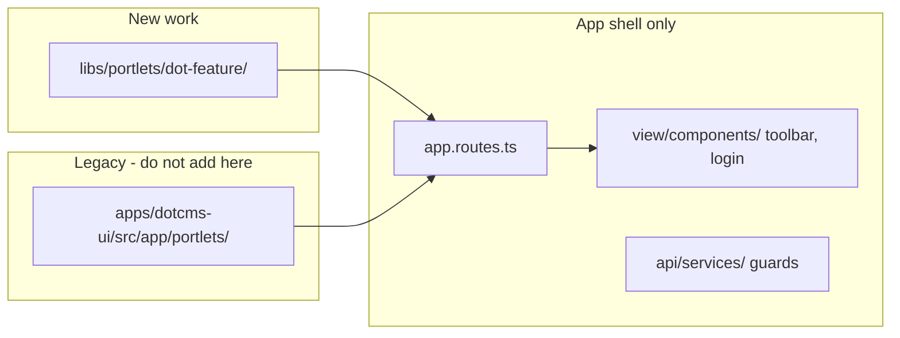

# dotcms-ui — Agent Guide

Main admin UI application for dotCMS (`/dotAdmin`). **Angular 21.2.1** with standalone components, `dot-` prefix, built and served through the Nx workspace. Agents working in this directory should read this file first, then refer to the parent guide for shared standards.

## UI Stack


| Layer             | Technology                             | Notes                                                                                                       |
| ----------------- | -------------------------------------- | ----------------------------------------------------------------------------------------------------------- |
| Component library | **PrimeNG**                            | Use `p-`* components (e.g. `p-button`, `p-select`, `p-dialog`) — check the PrimeNG MCP server for API/props |
| Utility CSS       | **Tailwind CSS**                       | Use Tailwind utilities for layout, spacing, and typography                                                  |
| Global styles     | `libs/dotcms-scss/angular/styles.scss` | Imported as a global stylesheet in the build                                                                |


**Key rules:**

- Use Tailwind utilities (`grid`, `flex`, `gap-`*, `p-*`, etc.) for layout and spacing
- Always use PrimeNG components for interactive UI (inputs, dropdowns, dialogs, tables) rather than raw HTML equivalents
- PrimeNG icons ship via `primeicons` (`pi pi-*` class names); this package is included in the global styles

> **Standards reference**: All Angular syntax rules, component conventions, testing patterns (Jest + Spectator), and code-placement decisions are documented in **[../../CLAUDE.md](../../CLAUDE.md)**. Do not duplicate them here.

## Commands

All commands must be run from the `core-web/` workspace root and prefixed with `yarn nx` (Nx is not installed globally).

```bash
# Development
yarn nx serve dotcms-ui                              # Dev server at :4200, proxies /api/* → :8080
yarn nx build dotcms-ui                             # Production build → dist/apps/dotcms-ui/
yarn nx build dotcms-ui --configuration=development  # Dev build → ../../tomcat9/webapps/ROOT/dotAdmin

# Tests
yarn nx test dotcms-ui                              # Run all unit tests
yarn nx test dotcms-ui --testPathPattern=my.spec    # Run a specific spec file
yarn nx lint dotcms-ui                              # Lint
```

## Portlets

A **portlet** is an admin UI feature served under `/dotAdmin`, backed by a backend menu entry (`DotMenuItem`). The `dotcms-ui` app is a **shell**: it does not implement feature logic itself. It hosts portlets via Angular routing inside `MainComponentLegacyComponent`'s `<router-outlet>`.


| Mode           | Where                                                        | Route pattern            |
| -------------- | ------------------------------------------------------------ | ------------------------ |
| Modern Angular | Nx lib or legacy app folder                                  | `/tags`, `/templates`, … |
| Legacy JSP     | iframe                                                       | `/c/:id`                 |
| Dynamic plugin | runtime registration via menu `initParams['angular-module']` | varies                   |


### Where portlets live




- **New portlets** → `[libs/portlets/{feature}/](../../libs/portlets/)` as Nx libraries. Canonical reference: `[dot-tags](../../libs/portlets/dot-tags/)`.
- **Legacy portlets** → still under `[src/app/portlets/](src/app/portlets/)` (templates, content-types, form-builder, etc.). Migrate to `libs/portlets/` when touching them substantially — do not add new features here.
- **App-local code** stays in the shell: `view/components/` (toolbar, login, contentlet editor), `api/services/` (guards, app services), `shared/models/`.

```
apps/dotcms-ui/src/app/
├── app.routes.ts       # portlet registry
├── view/components/    # shell chrome (toolbar, login, editors)
├── api/services/       # guards, app-level services
└── portlets/           # legacy features only — see above
```

### Nx lib pattern

Each modern portlet is an Nx library that exports routes for the app shell to lazy-load:

1. Lib lives at `libs/portlets/dot-{feature}/` (complex features may split into `{feature}/portlet`, `{feature}/data-access`).
2. Lib exports `dot{Feature}Routes` from `src/index.ts` / `lib.routes.ts`.
3. Path alias in `[tsconfig.base.json](../../tsconfig.base.json)`: `@dotcms/portlets/dot-{feature}/portlet` (legacy app portlets use `@portlets/...`).
4. Nx project name: `portlets-dot-{feature}-portlet`; tags: `type:feature`, `scope:dotcms-ui`, `portlet:{feature}`.
5. For generator setup, SignalStore rules, shell/list/store/CRUD patterns, and testing — see `**[libs/portlets/CLAUDE.md](../../libs/portlets/CLAUDE.md)**` (`dot-tags` is the reference implementation).

### Wiring into routing

Central registry: `[src/app/app.routes.ts](src/app/app.routes.ts)`.

1. Authenticated routes mount under `MainComponentLegacyComponent`.
2. `PORTLETS_ANGULAR` lazy-loads each Angular portlet via `loadChildren`.
3. Most entries use `MenuGuardService` to enforce backend menu permissions.
4. Legacy JSP portlets use `PORTLETS_IFRAME` → `IframePortletLegacyComponent`.

Adding a new portlet requires **both** the lib routes export **and** a new entry in `PORTLETS_ANGULAR`.

**In the lib** (`libs/portlets/dot-tags/src/lib/lib.routes.ts`):

```typescript
export const dotTagsRoutes: Route[] = [
    { path: '', component: DotTagsShellComponent }
];
```

**In the app shell** (`app.routes.ts`):

```typescript
{
    path: 'tags',
    canActivate: [MenuGuardService],
    canActivateChild: [MenuGuardService],
    loadChildren: () =>
        import('@dotcms/portlets/dot-tags/portlet').then((m) => m.dotTagsRoutes)
}
```

### Legacy portlets (app folder)

Portlets still under `src/app/portlets/` use NgModule-based routing (`feature-name.module.ts`, `feature-name-routing.module.ts`) and the `@portlets/...` path alias. Example: `[dot-templates](src/app/portlets/dot-templates/)`. Do not use this pattern for new work.

## Where Code Goes

See also the [Portlets](#portlets) section above for how features connect to routing.


| Scope                                | Location                                             |
| ------------------------------------ | ---------------------------------------------------- |
| New portlet / feature                | `libs/portlets/{feature}/` — **not** inside this app |
| UI presentational components         | `libs/ui/`                                           |
| Service to hit dotCMS rest apis      | `libs/data-access/`                                  |
| TypeScript interfaces / types        | `libs/dotcms-models/`                                |
| App-level component (toolbar, login) | `apps/dotcms-ui/src/app/view/components/`            |
| App-level service / guard            | `apps/dotcms-ui/src/app/api/services/`               |


For the full decision tree, see [../../CLAUDE.md § Code Placement Rules](../../CLAUDE.md).

## Key Assets Bundled at Build Time

The build copies several vendor assets into the output:

- `node_modules/tinymce` → `/tinymce/`
- `node_modules/monaco-editor` → `assets/monaco-editor/`
- `libs/block-editor/src/lib/assets` → `assets/block-editor/`
- `libs/portlets/edit-ema/portlet/src/lib/assets` → `assets/edit-ema/`

If these paths change (e.g. the block-editor moves), update `assets` in `project.json`.

## Implicit Dependencies

This app declares `"implicitDependencies": ["dotcms-webcomponents"]` in `project.json`. Changes to web components will trigger a rebuild of this app in affected-mode CI runs.