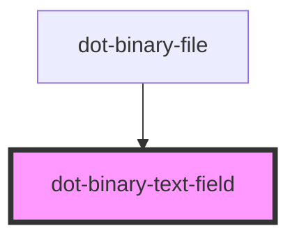

# dot-binary-text-field

<!-- Auto Generated Below -->

## Overview

Represent a dotcms text field for the binary file element.

## Properties

| Property      | Attribute     | Description                                                                                                                                                                                                                                                                                                                                                                                                                                                                                               | Type             | Default     |
| ------------- | ------------- | --------------------------------------------------------------------------------------------------------------------------------------------------------------------------------------------------------------------------------------------------------------------------------------------------------------------------------------------------------------------------------------------------------------------------------------------------------------------------------------------------------- | ---------------- | ----------- |
| `accept`      | `accept`      | (optional) Describes a type of file that may be selected by the user, separated by comma  eg: .pdf,.jpg                                                                                                                                                                                                                                                                                                                                                                                                   | `string`         | `undefined` |
| `disabled`    | `disabled`    | (optional) Disables field's interaction                                                                                                                                                                                                                                                                                                                                                                                                                                                                   | `boolean`        | `false`     |
| `hint`        | `hint`        | (optional) Hint text that suggest a clue of the field                                                                                                                                                                                                                                                                                                                                                                                                                                                     | `string`         | `''`        |
| `placeholder` | `placeholder` | (optional) Placeholder specifies a short hint that describes the expected value of the input field                                                                                                                                                                                                                                                                                                                                                                                                        | `string`         | `''`        |
| `required`    | `required`    | (optional) Determine if it is mandatory                                                                                                                                                                                                                                                                                                                                                                                                                                                                   | `boolean`        | `false`     |
| `value`       | `value`       | Value specifies the value of the <input> element.  `string \| File`, because both are assigned: `handleURLPaste` stores the pasted URL and `handleFilePaste` stores the pasted `File` itself. The `<input value>` in `render` accepts neither directly, so it coerces — which is what Stencil's attribute serialization already did, meaning a pasted file renders as `[object File]` rather than its name. That is a display bug, but repairing it changes what the user sees; see the note in `render`. | `File \| string` | `''`        |

## Events

| Event        | Description | Type                              |
| ------------ | ----------- | --------------------------------- |
| `fileChange` |             | `CustomEvent<DotBinaryFileEvent>` |
| `lostFocus`  |             | `CustomEvent<any>`                |

## Dependencies

### Used by

 - [dot-binary-file](../..)

### Graph

----------------------------------------------

*Built with [StencilJS](https://stenciljs.com/)*
