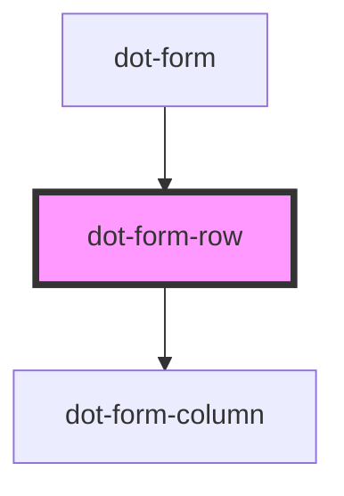

# dot-form-row

<!-- Auto Generated Below -->

## Properties

| Property       | Attribute        | Description                                                              | Type                         | Default     |
| -------------- | ---------------- | ------------------------------------------------------------------------ | ---------------------------- | ----------- |
| `fieldsToShow` | `fields-to-show` | (optional) List of fields (variableName) separated by comma, to be shown | `string`                     | `undefined` |
| `row`          | --               | Fields metada to be rendered                                             | `DotCMSContentTypeLayoutRow` | `undefined` |

## Dependencies

### Used by

 - [dot-form](../..)

### Depends on

- [dot-form-column](../dot-form-column)

### Graph

----------------------------------------------

*Built with [StencilJS](https://stenciljs.com/)*
