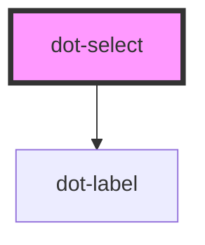

# dot-select

<!-- Auto Generated Below -->

## Overview

Represent a dotcms select control.

## Properties

| Property          | Attribute          | Description                                                                       | Type      | Default                    |
| ----------------- | ------------------ | --------------------------------------------------------------------------------- | --------- | -------------------------- |
| `disabled`        | `disabled`         | (optional) Disables field's interaction                                           | `boolean` | `false`                    |
| `hint`            | `hint`             | (optional) Hint text that suggest a clue of the field                             | `string`  | `''`                       |
| `label`           | `label`            | (optional) Text to be rendered next to input field                                | `string`  | `''`                       |
| `name`            | `name`             | Name that will be used as ID                                                      | `string`  | `''`                       |
| `options`         | `options`          | Value/Label dropdown options separated by comma, to be formatted as: Value\|Label | `string`  | `''`                       |
| `required`        | `required`         | (optional) Determine if it is mandatory                                           | `boolean` | `false`                    |
| `requiredMessage` | `required-message` | (optional) Text that will be shown when required is set and condition is not met  | `string`  | ``This field is required`` |
| `value`           | `value`            | Value set from the dropdown option                                                | `string`  | `''`                       |

## Events

| Event             | Description | Type                               |
| ----------------- | ----------- | ---------------------------------- |
| `dotStatusChange` |             | `CustomEvent<DotFieldStatusEvent>` |
| `dotValueChange`  |             | `CustomEvent<DotFieldValueEvent>`  |

## Methods

### `reset() => Promise<void>`

Reset properties of the field, clear value and emit events.

#### Returns

Type: `Promise<void>`

## Dependencies

### Depends on

- [dot-label](../dot-label)

### Graph

----------------------------------------------

*Built with [StencilJS](https://stenciljs.com/)*
