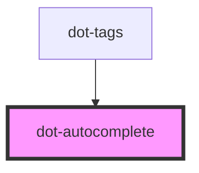

# dot-autocomplete

<!-- Auto Generated Below -->

## Properties

| Property      | Attribute     | Description                                                                                                                                                               | Type                                            | Default |
| ------------- | ------------- | ------------------------------------------------------------------------------------------------------------------------------------------------------------------------- | ----------------------------------------------- | ------- |
| `data`        | --            | Function or array of string to get the data to use for the autocomplete search.  Null until a consumer supplies one, which `componentDidLoad` checks before initialising. | `(() => string[] \| Promise<string[]>) \| null` | `null`  |
| `debounce`    | `debounce`    | (optional) Duraction in ms to start search into the autocomplete                                                                                                          | `number`                                        | `300`   |
| `disabled`    | `disabled`    | (optional) Disables field's interaction                                                                                                                                   | `boolean`                                       | `false` |
| `maxResults`  | `max-results` | (optional)  Max results to show after a autocomplete search                                                                                                               | `number`                                        | `0`     |
| `placeholder` | `placeholder` | (optional) text to show when no value is set                                                                                                                              | `string`                                        | `''`    |
| `threshold`   | `threshold`   | (optional)  Min characters to start search in the autocomplete input                                                                                                      | `number`                                        | `0`     |

## Events

| Event       | Description                                                                                                                                                                                                                                                                                                                                                                                                | Type                             |
| ----------- | ---------------------------------------------------------------------------------------------------------------------------------------------------------------------------------------------------------------------------------------------------------------------------------------------------------------------------------------------------------------------------------------------------------- | -------------------------------- |
| `enter`     |                                                                                                                                                                                                                                                                                                                                                                                                            | `CustomEvent<string>`            |
| `lostFocus` |                                                                                                                                                                                                                                                                                                                                                                                                            | `CustomEvent<FocusEvent>`        |
| `selection` | Emitted when a suggestion is chosen.  Typed `SelectionFeedback`, not `string`: nothing in this component calls `.emit()` — the event is dispatched by autocomplete.js on the inner input and bubbles to the host — and its payload is the library's own feedback object, which is what `dot-tags.onSelectHandler` reads (`detail.selection.value`). The declaration exists to type the `onSelection` prop. | `CustomEvent<SelectionFeedback>` |

## Dependencies

### Used by

 - [dot-tags](../..)

### Graph

----------------------------------------------

*Built with [StencilJS](https://stenciljs.com/)*
