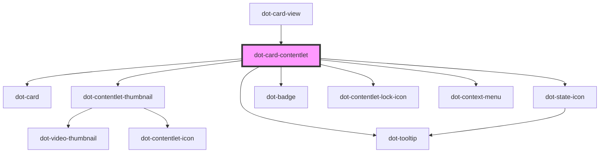

# dot-card-contentlet

<!-- Auto Generated Below -->

## Properties

| Property             | Attribute              | Description | Type                    | Default     |
| -------------------- | ---------------------- | ----------- | ----------------------- | ----------- |
| `checked`            | `checked`              |             | `boolean`               | `undefined` |
| `iconSize`           | `icon-size`            |             | `string`                | `'96px'`    |
| `item`               | --                     |             | `DotCardContentletItem` | `undefined` |
| `showVideoThumbnail` | `show-video-thumbnail` |             | `boolean`               | `false`     |
| `thumbnailSize`      | `thumbnail-size`       |             | `string`                | `'260'`     |

## Events

| Event              | Description | Type                                  |
| ------------------ | ----------- | ------------------------------------- |
| `checkboxChange`   |             | `CustomEvent<DotCardContentletEvent>` |
| `contextMenuClick` |             | `CustomEvent<MouseEvent>`             |

## Methods

### `hideMenu() => Promise<void>`

#### Returns

Type: `Promise<void>`

### `showMenu(x: number, y: number) => Promise<void>`

#### Returns

Type: `Promise<void>`

## Dependencies

### Used by

 - [dot-card-view](../../collections/dot-card-view)

### Depends on

- [dot-card](../../elements/dot-card)
- [dot-contentlet-thumbnail](../../elements/dot-contentlet-thumbnail)
- [dot-tooltip](../../elements/dot-tooltip)
- [dot-state-icon](../../elements/dot-state-icon)
- [dot-badge](../../elements/dot-badge)
- [dot-contentlet-lock-icon](../../elements/dot-contentlet-lock-icon)
- [dot-context-menu](../dot-context-menu)

### Graph

----------------------------------------------

*Built with [StencilJS](https://stenciljs.com/)*
