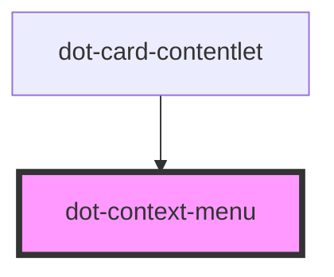

# dot-context-menu

<!-- Auto Generated Below -->

## Properties

| Property   | Attribute   | Description | Type                                           | Default  |
| ---------- | ----------- | ----------- | ---------------------------------------------- | -------- |
| `fontSize` | `font-size` |             | `string`                                       | `'16px'` |
| `options`  | --          |             | `DotContextMenuOption<DotContextMenuAction>[]` | `[]`     |

## Methods

### `hide() => Promise<void>`

#### Returns

Type: `Promise<void>`

### `show(x: number, y: number, position?: string) => Promise<void>`

#### Parameters

| Name       | Type     | Description |
| ---------- | -------- | ----------- |
| `x`        | `number` |             |
| `y`        | `number` |             |
| `position` | `string` |             |

#### Returns

Type: `Promise<void>`

## Dependencies

### Used by

 - [dot-card-contentlet](../dot-card-contentlet)

### Graph

----------------------------------------------

*Built with [StencilJS](https://stenciljs.com/)*
