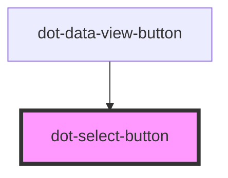

# dot-switch

<!-- Auto Generated Below -->

## Properties

| Property  | Attribute | Description | Type                      | Default |
| --------- | --------- | ----------- | ------------------------- | ------- |
| `options` | --        |             | `DotSelectButtonOption[]` | `[]`    |
| `value`   | `value`   |             | `string`                  | `''`    |

## Events

| Event      | Description | Type                  |
| ---------- | ----------- | --------------------- |
| `selected` |             | `CustomEvent<string>` |

## Dependencies

### Used by

 - [dot-data-view-button](../dot-data-view-button)

### Graph

----------------------------------------------

*Built with [StencilJS](https://stenciljs.com/)*
