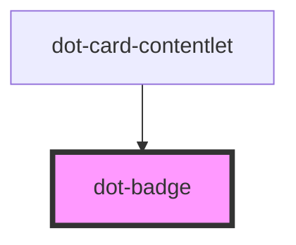

# dot-badge

<!-- Auto Generated Below -->

## Properties

| Property   | Attribute  | Description | Type      | Default |
| ---------- | ---------- | ----------- | --------- | ------- |
| `bgColor`  | `bg-color` |             | `string`  | `null`  |
| `bordered` | `bordered` |             | `boolean` | `false` |
| `color`    | `color`    |             | `string`  | `null`  |
| `size`     | `size`     |             | `string`  | `null`  |

## Dependencies

### Used by

 - [dot-card-contentlet](../../components/dot-card-contentlet)

### Graph

----------------------------------------------

*Built with [StencilJS](https://stenciljs.com/)*
