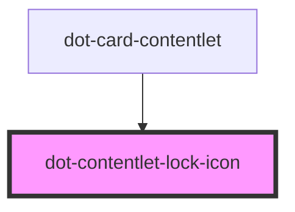

# dot-contentlet-lock-icon

<!-- Auto Generated Below -->

## Properties

| Property | Attribute | Description | Type      | Default     |
| -------- | --------- | ----------- | --------- | ----------- |
| `locked` | `locked`  |             | `boolean` | `undefined` |
| `size`   | `size`    |             | `string`  | `'16px'`    |

## Dependencies

### Used by

 - [dot-card-contentlet](../../components/dot-card-contentlet)

### Graph

----------------------------------------------

*Built with [StencilJS](https://stenciljs.com/)*
