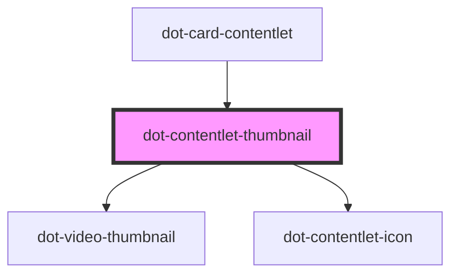

# dot-contentlet-thumbnail

<!-- Auto Generated Below -->

## Properties

| Property             | Attribute              | Description | Type                | Default     |
| -------------------- | ---------------------- | ----------- | ------------------- | ----------- |
| `alt`                | `alt`                  |             | `string`            | `''`        |
| `backgroundImage`    | `background-image`     |             | `boolean`           | `false`     |
| `contentlet`         | --                     |             | `DotContentletItem` | `undefined` |
| `fieldVariable`      | `field-variable`       |             | `string`            | `''`        |
| `height`             | `height`               |             | `string`            | `''`        |
| `iconSize`           | `icon-size`            |             | `string`            | `''`        |
| `playableVideo`      | `playable-video`       |             | `boolean`           | `false`     |
| `showVideoThumbnail` | `show-video-thumbnail` |             | `boolean`           | `true`      |
| `width`              | `width`                |             | `string`            | `''`        |

## Dependencies

### Used by

 - [dot-card-contentlet](../../components/dot-card-contentlet)

### Depends on

- [dot-video-thumbnail](../dot-video-thumbnail)
- [dot-contentlet-icon](../dot-contentlet-icon)

### Graph

----------------------------------------------

*Built with [StencilJS](https://stenciljs.com/)*
