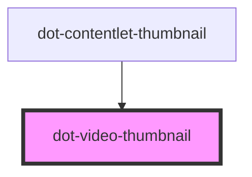

# dot-video-thumbnail

<!-- Auto Generated Below -->

## Properties

| Property     | Attribute  | Description                      | Type                | Default     |
| ------------ | ---------- | -------------------------------- | ------------------- | ----------- |
| `contentlet` | --         |                                  | `DotContentletItem` | `undefined` |
| `cover`      | `cover`    |                                  | `boolean`           | `true`      |
| `playable`   | `playable` | If the video is playable or not. | `boolean`           | `false`     |
| `variable`   | `variable` |                                  | `string`            | `undefined` |

## Dependencies

### Used by

 - [dot-contentlet-thumbnail](../dot-contentlet-thumbnail)

### Graph

----------------------------------------------

*Built with [StencilJS](https://stenciljs.com/)*
