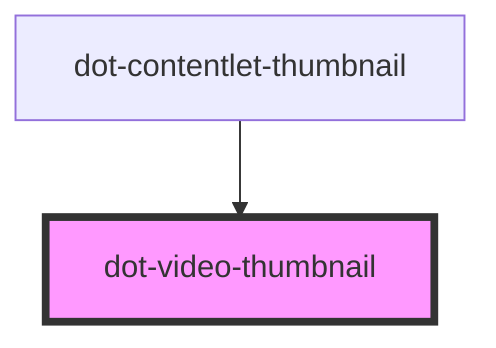

# dot-video-thumbnail

<!-- Auto Generated Below -->

## Properties

| Property                  | Attribute  | Description                                                                                                                                                                                                                              | Type                  | Default     |
| ------------------------- | ---------- | ---------------------------------------------------------------------------------------------------------------------------------------------------------------------------------------------------------------------------------------- | --------------------- | ----------- |
| `contentlet` _(required)_ | --         | Required in practice, not optional: `render` destructures it and the video URL interpolates its inode, so a missing contentlet has always thrown rather than degraded — the same reason `dot-contentlet-thumbnail` declares it this way. | `DotContentletItem`   | `undefined` |
| `cover`                   | `cover`    |                                                                                                                                                                                                                                          | `boolean`             | `true`      |
| `playable`                | `playable` | If the video is playable or not.                                                                                                                                                                                                         | `boolean`             | `false`     |
| `variable`                | `variable` |                                                                                                                                                                                                                                          | `string \| undefined` | `undefined` |

## Dependencies

### Used by

 - [dot-contentlet-thumbnail](../dot-contentlet-thumbnail)

### Graph

```mermaid
graph TD;
  dot-contentlet-thumbnail --> dot-video-thumbnail
  style dot-video-thumbnail fill:#f9f,stroke:#333,stroke-width:4px
```

----------------------------------------------

*Built with [StencilJS](https://stenciljs.com/)*
