# dotCMS LGTM Observability Stack Architecture

## Complete Architecture Diagram

```mermaid
flowchart LR
    subgraph infra ["🗄️ Infrastructure"]
        direction TB
        db[("🐘 PostgreSQL<br/>:5432")]
        search[("🔍 OpenSearch<br/>:9200")]
    end

    subgraph dotcms ["🖥️ dotCMS Container"]
        direction TB
        server["📦 dotCMS Server<br/>Java Application"]
        
        subgraph agents ["Java Agents"]
            direction LR
            otel["🔍 OpenTelemetry<br/>Agent v2.18.1"]
            pyro["📊 Pyroscope<br/>Agent v0.18.1"]
        end
        
        subgraph endpoints ["HTTP Endpoints"]
            direction TB
            metrics["/dotmgt/metrics<br/>📈 Prometheus"]
            health["/dotmgt/livez<br/>💚 Health"]
        end
    end

    subgraph lgtm ["🏗️ LGTM Stack (Single Container)"]
        direction TB
        
        receivers["📥 OTLP Collector<br/>:4318 | :4317"]
        
        subgraph storage ["📊 Storage Layer"]
            direction LR
            prom["📈 Prometheus<br/>:9090"]
            loki["📄 Loki<br/>:3100"] 
            tempo["🔗 Tempo<br/>:3200"]
            pyroscope["🔥 Pyroscope<br/>:4040"]
        end
        
        grafana["🎨 Grafana UI<br/>:3000"]
    end

    %% Application dependencies
    server --> infra

    %% Internal dotCMS flows
    server -.-> agents
    server --> endpoints

    %% Push-based telemetry flows
    otel ==>|"🚀 PUSH<br/>OTLP<br/>Traces,Metrics,Logs"| receivers
    pyro ==>|"🚀 PUSH<br/>JFR Profiles"| pyroscope

    %% Pull-based metrics flows  
    prom -.->|"⬇️ PULL<br/>30s"| metrics
    prom -.->|"⬇️ PULL"| health

    %% OTLP collector routing
    receivers --> prom
    receivers --> loki
    receivers --> tempo

    %% Grafana visualization
    grafana --> storage

    %% Styling
    classDef container fill:#e3f2fd,stroke:#1976d2,stroke-width:2px
    classDef component fill:#f3e5f5,stroke:#7b1fa2,stroke-width:2px
    classDef storage fill:#e8f5e8,stroke:#388e3c,stroke-width:2px
    classDef endpoint fill:#fff3e0,stroke:#f57c00,stroke-width:2px
    classDef database fill:#fce4ec,stroke:#c2185b,stroke-width:2px
    
    class dotcms,lgtm,infra container
    class server,otel,pyro,receivers,grafana component
    class prom,loki,tempo,pyroscope storage
    class metrics,health endpoint
    class db,search database
```



## Simplified Data Flow Overview

```mermaid
flowchart LR
    subgraph dotcms ["dotCMS"]
        app["🖥️ Application"]
        otel["🔍 OTEL Agent"]  
        pyro["📊 Pyroscope Agent"]
        metrics["📈 /metrics"]
    end

    subgraph lgtm ["LGTM Stack"]
        collector["📥 OTEL Collector"]
        prom["📊 Prometheus"] 
        loki["📄 Loki"]
        tempo["🔗 Tempo"]
        pyroscope["🔥 Pyroscope"]
        grafana["🎨 Grafana"]
    end

    %% PUSH flows (agents actively send data)
    otel ==>|"🚀 PUSH<br/>OTLP<br/>Traces,Metrics,Logs"| collector
    pyro ==>|"🚀 PUSH<br/>JFR Profiles"| pyroscope
    
    %% PULL flows (prometheus scrapes data)
    prom -.->|"⬇️ PULL<br/>HTTP"| metrics
    
    %% OTLP Data routing
    collector --> prom
    collector --> loki  
    collector --> tempo
    
    %% Grafana visualization
    grafana --> prom
    grafana --> loki
    grafana --> tempo
    grafana --> pyroscope

    classDef push fill:#ffebee,stroke:#e53935,stroke-width:2px
    classDef pull fill:#e8f5e8,stroke:#43a047,stroke-width:2px
    
    class otel,pyro push
    class prom,metrics pull
```



## Data Flow Details

### 1. Push-based Telemetry (OTLP Protocol)

#### OpenTelemetry Agent → LGTM Stack
- **Protocol**: OTLP over HTTP (protobuf)
- **Endpoint**: `http://lgtm:4318`
- **Data Types**: Traces, Metrics, Logs
- **Configuration**:
  ```yaml
  OTEL_EXPORTER_OTLP_ENDPOINT: 'http://lgtm:4318'
  OTEL_EXPORTER_OTLP_PROTOCOL: 'http/protobuf'
  OTEL_TRACES_EXPORTER: 'otlp'
  OTEL_METRICS_EXPORTER: 'otlp'  
  OTEL_LOGS_EXPORTER: 'otlp'
  ```

#### Log4j → Loki (via OTEL)
- **Flow**: Log4j → OTEL Agent → OTEL Collector → Loki
- **Format**: Structured JSON logs with metadata
- **Configuration**:
  ```yaml
  OTEL_INSTRUMENTATION_LOGBACK_APPENDER_ENABLED: 'true'
  OTEL_INSTRUMENTATION_LOG4J_APPENDER_ENABLED: 'true'
  OTEL_LOGS_INCLUDE_LEVEL: 'WARN'  # Only WARN+ logs
  ```

#### Pyroscope Agent → Pyroscope Server
- **Protocol**: HTTP with JFR format
- **Endpoint**: `http://lgtm:4040`
- **Data**: Continuous profiling data from Java Flight Recorder
- **Configuration**:
  ```yaml
  PYROSCOPE_SERVER_ADDRESS: 'http://lgtm:4040'
  PYROSCOPE_FORMAT: 'jfr'
  PYROSCOPE_PROFILING_INTERVAL: '10ms'
  PYROSCOPE_UPLOAD_INTERVAL: '10s'
  ```

### 2. Pull-based Metrics (HTTP Scraping)

#### Prometheus → dotCMS Micrometer Metrics
- **Protocol**: HTTP GET requests
- **Endpoint**: `http://dotcms:8090/dotmgt/metrics`
- **Format**: Prometheus text format
- **Interval**: 30 seconds
- **Metrics Types**:
  - Database: HikariCP connection pool metrics
  - JVM: Memory, GC, threads
  - HTTP: Request rates, latency, status codes  
  - Cache: Hit ratios, evictions
  - Tomcat: Connector and thread pool metrics

#### Prometheus → dotCMS Health Endpoint
- **Protocol**: HTTP GET requests
- **Endpoint**: `http://dotcms:8090/dotmgt/livez`
- **Purpose**: Service availability monitoring
- **Interval**: 30 seconds

## LGTM Stack Internal Components

### OpenTelemetry Collector Pipeline
```
OTLP Receivers (gRPC/HTTP) 
    ↓
Batch Processors (optimize throughput)
    ↓  
Resource Processors (add metadata)
    ↓
Exporters (route to storage backends)
    ├── Prometheus (metrics)
    ├── Loki (logs) 
    └── Tempo (traces)
```

### Key OTLP Configuration
- **gRPC Port**: 4317 (traditional OTLP)
- **HTTP Port**: 4318 (used by dotCMS for better compatibility)
- **Protocol**: HTTP with protobuf encoding
- **Compression**: gzip enabled
- **Batch Size**: 64 spans/metrics per batch (optimized)
- **Export Timeout**: 5 seconds

## Agent Integration Details

### OpenTelemetry Java Agent (v2.18.1)
- **Installation**: Downloaded by init container to `/agents/` volume
- **Loading**: Via `CMS_JAVA_OPTS: '-javaagent:/srv/dotserver/tomcat/agents/opentelemetry-javaagent.jar'`
- **Instrumentation**: Auto-instruments HTTP, JDBC, logging frameworks
- **Sampling**: 10% trace sampling (`OTEL_TRACES_SAMPLER_ARG: '0.1'`)
- **Cardinality Limit**: 2000 metrics to prevent explosion

### Pyroscope Java Agent (v0.18.1)  
- **Installation**: Downloaded by init container alongside OTEL agent
- **Loading**: Via `CMS_JAVA_OPTS: '-javaagent:/srv/dotserver/tomcat/agents/pyroscope.jar'`
- **JFR Integration**: Uses Java Flight Recorder events
- **Profiling Types**:
  - CPU profiling (10ms intervals)
  - Allocation tracking (512k threshold)
  - Lock contention (10ms threshold)
- **Upload**: Profiles uploaded every 10 seconds

## Network Architecture

### Networks
- **app-net**: dotCMS ↔ PostgreSQL, OpenSearch communication
- **observability-net**: dotCMS ↔ LGTM stack telemetry data

### Port Mapping
| Service | Internal Port | External Port | Purpose |
|---------|--------------|---------------|---------|
| Grafana | 3000 | 3000 | Web UI |
| OTLP gRPC | 4317 | 4317 | OTLP gRPC receiver |
| OTLP HTTP | 4318 | 4318 | OTLP HTTP receiver |  
| Pyroscope | 4040 | 4040 | Profiling server |
| dotCMS App | 8082 | 8082 | Application HTTP |
| dotCMS Mgmt | 8090 | 8090 | Management/metrics |
| PostgreSQL | 5432 | 5432 | Database |

## Observability Data Types

### 1. Micrometer Metrics (Native dotCMS)
**Source**: dotCMS application code
**Transport**: HTTP scraping by Prometheus
**Examples**:
```promql
# Database connection pool utilization
dotcms_database_hikari_connections_active{pool="jdbc/dotCMSPool"}

# JVM heap memory usage  
dotcms_jvm_memory_used_bytes{area="heap"}

# HTTP request rate
rate(dotcms_http_server_requests_seconds_count[5m])

# Cache hit ratio
dotcms_cache_hit_ratio{cache="IDENTIFIER_CACHE"}
```

### 2. OpenTelemetry Traces
**Source**: OTEL Java agent auto-instrumentation  
**Transport**: OTLP push to Tempo
**Examples**:
- HTTP request spans with timing
- Database query spans with SQL statements
- Inter-service call traces
- Error and exception traces

### 3. OpenTelemetry Metrics  
**Source**: OTEL Java agent instrumentation
**Transport**: OTLP push to Prometheus
**Examples**:
```promql
# Request duration from OTEL
http_server_request_duration_seconds{service_name="dotcms"}

# JVM memory from OTEL  
jvm_memory_used_bytes{service_name="dotcms"}

# Database operation duration
db_client_operation_duration_seconds{service_name="dotcms"}
```

### 4. Structured Logs
**Source**: Log4j appenders via OTEL instrumentation
**Transport**: OTLP push to Loki
**Examples**:
```logql
# Application errors
{service_name="dotcms"} |= "ERROR"

# Database-related logs
{service_name="dotcms"} |= "SQLException" | json

# Specific log levels
{service_name="dotcms"} | json | level="WARN"
```

### 5. Continuous Profiling
**Source**: Pyroscope agent reading JFR events  
**Transport**: HTTP push to Pyroscope server
**Data Types**:
- CPU flame graphs
- Memory allocation profiles  
- Lock contention analysis
- Method execution hotspots

## Key Configuration Files

### Prometheus Scraping (`prometheus-config.yml`)
```yaml
scrape_configs:
  - job_name: "dotcms-metrics"
    static_configs:
      - targets: ["dotcms:8090"]  
    metrics_path: "/dotmgt/metrics"
    scrape_interval: 30s
    
  - job_name: "dotcms-health"
    static_configs:
      - targets: ["dotcms:8090"]
    metrics_path: "/dotmgt/livez"  
    scrape_interval: 30s
```

### Dashboard Provisioning (`provisioning/dashboards/dashboards.yaml`)
```yaml
providers:
  - name: 'dotcms-dashboards'
    orgId: 1
    folder: 'dotCMS'
    type: file
    path: /otel-lgtm/grafana/dashboards/dotcms
```

## Performance Optimizations

### Reduced Telemetry Volume
- **Trace Sampling**: 10% instead of 100%
- **Metrics Cardinality**: Limited to 2000 metrics
- **Log Level**: Only WARN+ logs instead of INFO+
- **Batch Sizes**: Smaller batches (64 vs 256) for faster exports
- **Export Frequency**: Metrics every 60s instead of 30s

### Resource Limits  
- **OTLP Message Size**: 8MB max (reasonable for production)
- **Prometheus Sample Limit**: 10,000 per scrape
- **Connection Timeouts**: 5-10 second timeouts for responsiveness

This architecture provides comprehensive observability for dotCMS through a production-ready stack, combining both pull-based (Prometheus scraping) and push-based (OTLP) telemetry collection patterns.