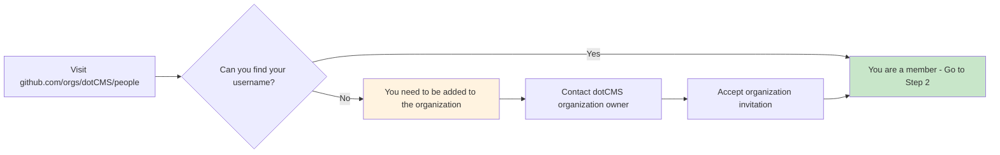
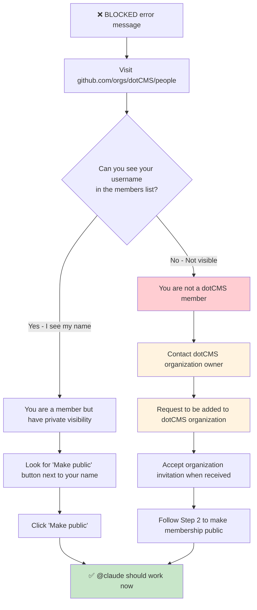

# Claude Code Security Implementation Guide

## Overview

This document provides a comprehensive guide to the security implementation for Claude Code integration in the dotCMS repository. It covers the membership gate system, user requirements, and troubleshooting steps.

## Security Architecture

### Core Security Principle

Claude Code uses a **zero-trust security model** with organization membership verification to ensure only authorized dotCMS team members can trigger AI-powered code assistance.

### Security Gate Implementation

```mermaid
graph TB
    A[User mentions @claude] --> B[GitHub Action Triggered]
    B --> C[Extract username from event]
    C --> D[Organization Membership Check]
    
    D --> E{GitHub API:<br/>GET /orgs/dotCMS/members/{username}}
    
    E -->|HTTP 204| F[✅ Member Verified]
    E -->|HTTP 404| G[❌ Access Denied]
    
    F --> H[Continue Claude Workflow]
    G --> I[Display Error & Troubleshooting]
    
    subgraph "Security Features"
        J[Hardcoded Organization: dotCMS]
        K[No Additional Secrets Required]
        L[Detects Public & Private Members]
        M[Graceful Error Messages]
    end
    
    style F fill:#c8e6c9
    style G fill:#ffcdd2
    style H fill:#c8e6c9
    style I fill:#ffcdd2
```

## User Requirements

### Organization Membership Requirements

To use Claude Code (@claude mentions), users must satisfy **ALL** of these requirements:

1. ✅ **Be a member of the dotCMS GitHub organization**
2. ✅ **Have PUBLIC membership visibility**

### Current Status (as of October 2025)

**All dotCMS organization members** must make their membership public to use @claude mentions.

## User Guide: Setting Up Claude Code Access

### Step 1: Verify Organization Membership

1. Navigate to: https://github.com/orgs/dotCMS/people
2. Look for your username in the member list
3. If you don't see your name, you're not a member yet



### Step 2: Make Membership Public

If you are a member but have private visibility:

1. Visit: https://github.com/orgs/dotCMS/people
2. Find your username in the list
3. Look for a **"Make public"** button next to your name
4. Click **"Make public"**
5. Your membership is now visible to the security gate

```mermaid
graph TD
    A[Find your name on dotCMS members page] --> B{See 'Make public' button?}
    B -->|Yes| C[Click 'Make public']
    B -->|No| D[Membership already public ✅]
    
    C --> E[Membership now public ✅]
    E --> F[@claude commands will work]
    D --> F
    
    style E fill:#c8e6c9
    style D fill:#c8e6c9
    style F fill:#c8e6c9
```

### Step 3: Test Claude Code Access

1. Go to any issue or pull request in the dotCMS/core repository
2. Comment with: `@claude hello`
3. If successful, Claude will respond
4. If blocked, follow the troubleshooting guide below

## Troubleshooting Guide

### Error: "❌ BLOCKED: [username] failed organization membership check"

This error means the security gate detected that you are not authorized to use Claude Code.

#### Troubleshooting Decision Tree



### Common Issues and Solutions

#### Issue 1: "I'm definitely a dotCMS member but still blocked"

**Solution**: Check your membership visibility
1. Visit https://github.com/orgs/dotCMS/people
2. If you see "Make public" next to your name, click it
3. Wait 30 seconds and try @claude again

#### Issue 2: "I don't see the dotCMS organization members page"

**Solution**: You may not be a member yet
1. Contact your manager or a dotCMS organization owner
2. Request to be added to the dotCMS GitHub organization
3. Accept the invitation email when it arrives

#### Issue 3: "@claude worked before but stopped working"

**Solution**: Check if membership visibility changed
1. Visit https://github.com/orgs/dotCMS/people  
2. If you see "Make public", your visibility was changed to private
3. Click "Make public" to restore access

#### Issue 4: "GitHub API errors or intermittent failures"

**Solution**: Temporary API issues
1. Wait 5-10 minutes and try again
2. GitHub API may experience temporary delays
3. If problem persists, report in #guild-dev-pipeline Slack channel

## Technical Implementation Details

### Security Action Location

The organization membership check is implemented as a reusable composite action:

```
.github/actions/security/org-membership-check/
├── action.yml          # Main action implementation
└── README.md          # Detailed technical documentation
```

### API Endpoint Used

The security gate uses the GitHub API endpoint:
```
GET /orgs/dotCMS/members/{username}
```

**Response Codes**:
- `HTTP 204 No Content`: User is a member (authorized)
- `HTTP 404 Not Found`: User is not a member or has private membership (blocked)

### Token Requirements

- **Token Type**: Default `GITHUB_TOKEN` (no additional secrets required)
- **Permissions**: Standard repository token permissions
- **Scope**: Read organization membership (public members only)

## Security Benefits

### ✅ What This System Prevents

1. **Unauthorized Access**: Only dotCMS organization members can use Claude
2. **External Abuse**: External users cannot trigger expensive AI operations  
3. **Credential Exposure**: No additional secrets or tokens required
4. **Privilege Escalation**: Cannot bypass organization membership requirement

### ✅ What This System Allows

1. **Team Collaboration**: All dotCMS team members can use Claude when properly configured
2. **Transparent Security**: Clear error messages and troubleshooting steps
3. **Zero Configuration**: Works with default GitHub permissions
4. **Audit Trail**: All access attempts are logged

## Limitations

### Current Limitations

1. **Public Membership Requirement**: Users must make org membership public
2. **Single Organization**: Only works for dotCMS organization members  
3. **No Granular Permissions**: All-or-nothing access (no team-level restrictions)
4. **Manual Setup**: Users must manually make membership public

### Why Public Membership is Required

The GitHub API has the following behavior when checking organization membership:

- **With Organization Secrets**: Can detect both public and private members
- **With Repository Tokens**: Can only detect public members

Since Claude Code uses repository-level tokens for security reasons (no organization secrets in PR workflows), only public members can be detected.

## Best Practices for Users

### ✅ Recommended Actions

1. **Make Membership Public**: Required for Claude Code access
2. **Test Access**: Verify @claude works after making membership public
3. **Keep Membership Updated**: If you leave/rejoin the organization, update visibility
4. **Report Issues**: Use #guild-dev-pipeline for security gate problems

### ❌ What Not to Do

1. **Don't Share Accounts**: Each user must have their own GitHub account
2. **Don't Request Bypasses**: No mechanism exists to bypass the security gate
3. **Don't Use Personal Tokens**: The system uses repository tokens only
4. **Don't Modify Security Actions**: Changes require security review

## Monitoring and Logging

### Log Messages

**Successful Authorization**:
```
✅ AUTHORIZED: [username] is a dotCMS organization member
```

**Access Denied**:
```  
❌ BLOCKED: [username] failed organization membership check
```

### Where to Get Help

1. **Primary Support**: #guild-dev-pipeline Slack channel
2. **Documentation**: This guide and related docs in `/docs/core/`
3. **GitHub Issues**: Technical issues with the security implementation

## Future Enhancements

### Planned Improvements

1. **Team-Based Access Control**: Allow specific GitHub team membership
2. **Usage Analytics**: Track Claude usage patterns by user
3. **Rate Limiting**: Implement per-user usage limits
4. **Enhanced Logging**: More detailed security audit logs

### Considerations for Enhancement

1. **Maintain Security**: Any changes must maintain current security level
2. **User Experience**: Improvements should make access easier, not harder
3. **Performance**: Security checks should remain fast and reliable
4. **Compliance**: Changes must comply with organizational security policies

---

**Last Updated**: October 2025  
**Document Owner**: dotCMS Engineering Team  
**Review Cycle**: Quarterly or after security changes