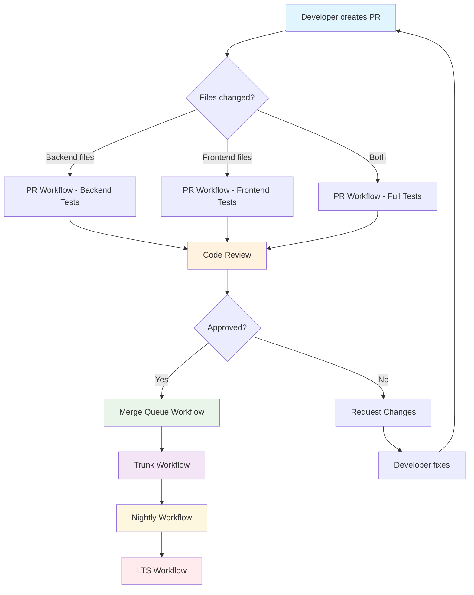
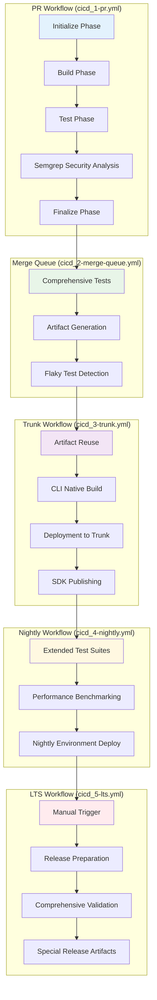
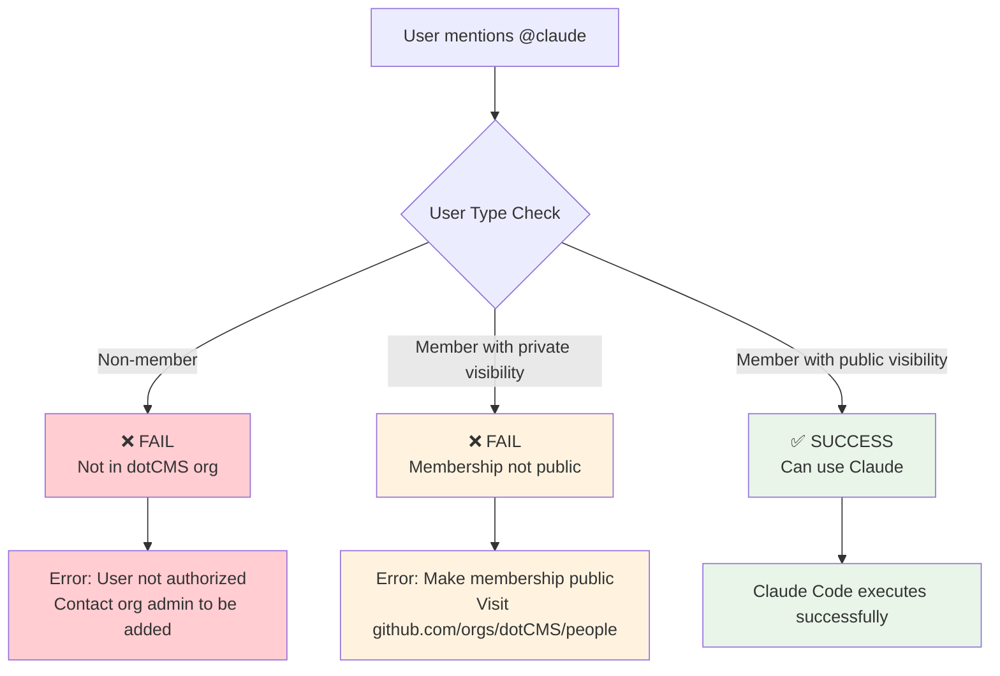
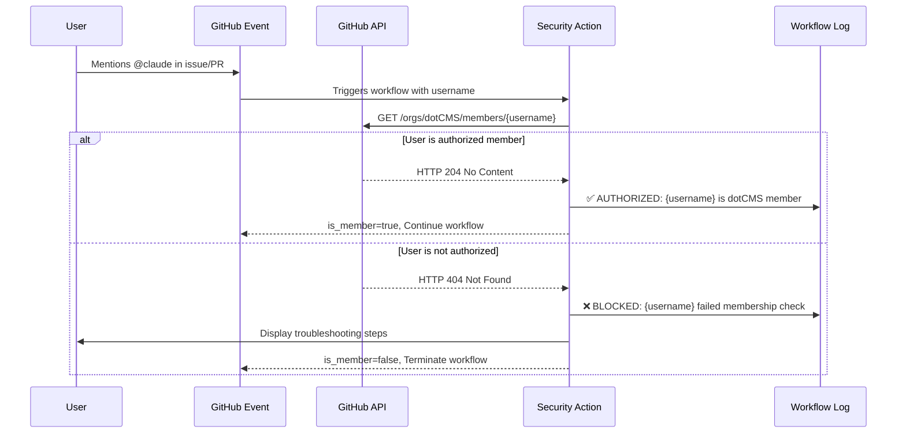
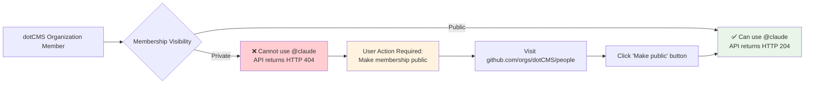
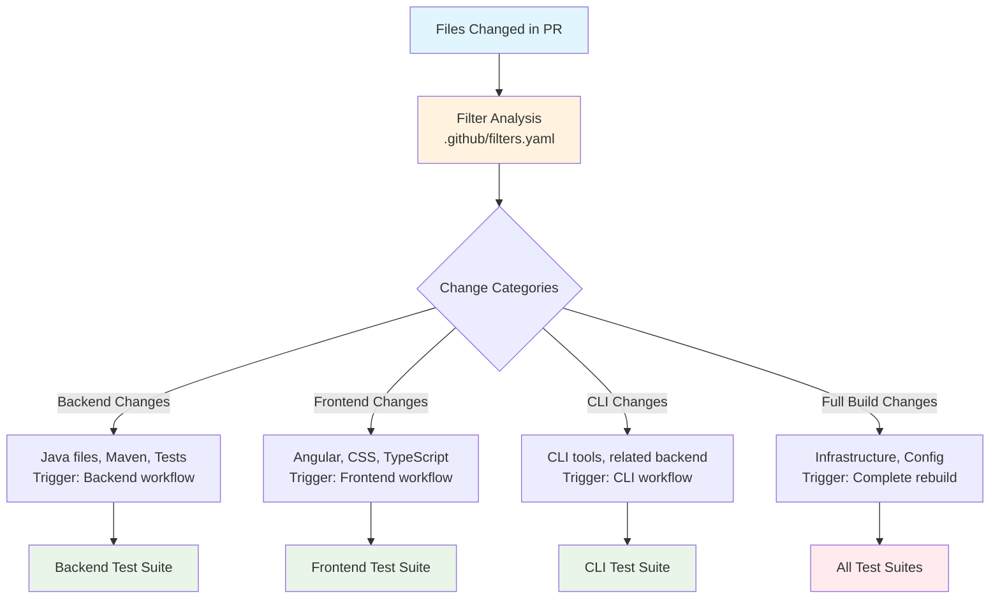
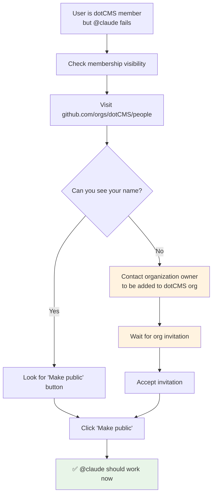
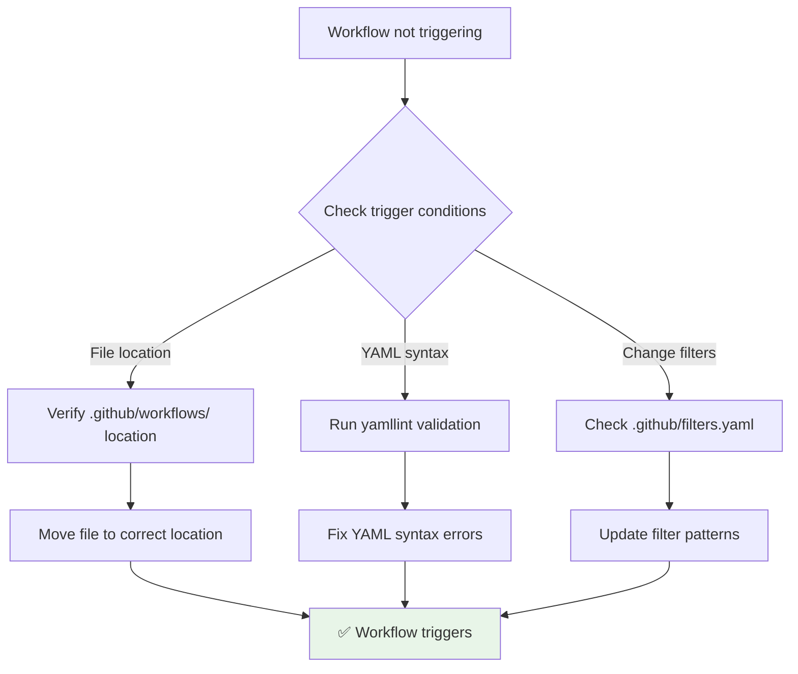
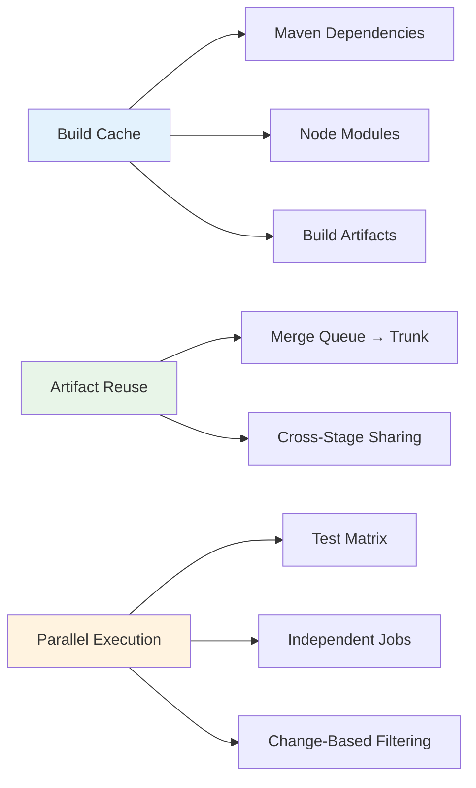

# GitHub Workflows and Claude Code Security Gates

## Overview

This document provides visual flow diagrams and decision trees for dotCMS GitHub workflows, with a focus on the Claude Code security implementation that requires organization membership verification.

## GitHub Workflow Architecture

### High-Level Workflow Flow



### Core Workflow Components



## Claude Code Security Implementation

### Organization Membership Security Gate

The Claude Code integration uses a sophisticated security system to ensure only authorized dotCMS organization members can trigger AI-powered code reviews and assistance.

#### Security Gate Decision Tree

```mermaid
graph TD
    A[@claude mention detected] --> B[Extract username from GitHub event]
    B --> C[Organization Membership Check Action]
    
    C --> D{GitHub API Call<br/>GET /orgs/dotCMS/members/{username}}
    
    D -->|HTTP 204 No Content| E[✅ User is authorized]
    D -->|HTTP 404 Not Found| F[❌ User is blocked]
    
    E --> G[Claude Code Workflow Continues]
    E --> H[Log: ✅ AUTHORIZED]
    
    F --> I[Display troubleshooting steps]
    F --> J[Log: ❌ BLOCKED]
    F --> K[Workflow terminated]
    
    I --> L[Show membership verification guide]
    
    style A fill:#e1f5fe
    style E fill:#e8f5e8
    style F fill:#ffebee
    style G fill:#e8f5e8
    style K fill:#ffcdd2
```

### User Access Scenarios

Based on the acceptance criteria from the testing issue:



## Detailed Security Implementation

### Organization Membership Check Action

The security gate is implemented as a reusable composite action located at:
`.github/actions/security/org-membership-check/action.yml`

#### Implementation Flow



### Security Features

1. **Hardcoded Organization**: Only checks `dotCMS` organization membership
2. **No Additional Secrets**: Uses default `GITHUB_TOKEN`
3. **Both Public and Private Members**: API detects all organization members
4. **Clear Error Messages**: Provides actionable troubleshooting steps
5. **Graceful Failure**: Fails securely when membership cannot be verified

### Membership Visibility Requirements



## Change Detection System

The workflow system uses intelligent change detection to optimize build and test execution:



## Troubleshooting Guide

### Common Issues and Solutions

#### Issue: User is dotCMS member but @claude fails



#### Issue: Workflow doesn't trigger



## Current Authorized Users

Based on the testing issue, only 3 users currently have public organization membership:

- @fmontes
- @oidacra  
- @sfreudenthaler

**All other dotCMS organization members must set their membership visibility to public to use @claude mentions.**

## Security Best Practices

### ✅ Security Patterns Used

1. **Zero-Trust PR Context**: No secrets exposed in pull request workflows
2. **Minimal Token Usage**: Uses default GITHUB_TOKEN only
3. **Hardcoded Organization**: Cannot be overridden or manipulated
4. **Graceful Error Handling**: Fails securely with helpful messages
5. **Public Membership Requirement**: Ensures transparency

### ❌ Security Anti-Patterns Avoided

1. **No Secret Exposure**: Secrets never exposed in PR context
2. **No Bypasses**: No way to bypass organization membership check  
3. **No Token Elevation**: No additional permissions requested
4. **No User Input Injection**: All inputs sanitized and validated

## Performance Optimizations

### Caching Strategy



## Integration Points

This security implementation integrates with:

- **Issue Management**: Links to GitHub issue workflows
- **PR Processing**: Integrates with PR review workflows  
- **Release Pipeline**: Connects to trunk and release workflows
- **Monitoring**: Sends notifications to #guild-dev-pipeline Slack channel

## Future Enhancements

Potential improvements to the security system:

1. **Team-Based Access**: Allow specific team membership instead of org-wide
2. **Rate Limiting**: Implement usage limits per user
3. **Audit Logging**: Enhanced logging for security monitoring
4. **Integration Testing**: Automated tests for security gate functionality

---

**Location**: `docs/core/GITHUB_WORKFLOWS_VISUAL.md`  
**Related Files**:
- `.github/actions/security/org-membership-check/action.yml`
- `.github/filters.yaml` 
- `docs/core/GIT_WORKFLOWS.md`
- `docs/core/GITHUB_ISSUE_MANAGEMENT.md`