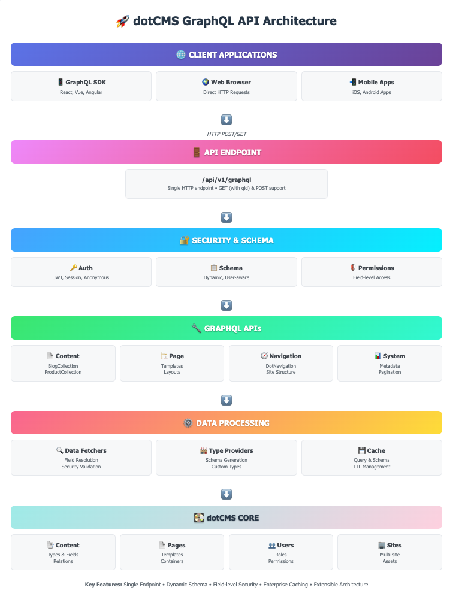

# dotCMS GraphQL API

A comprehensive GraphQL API implementation for dotCMS that provides flexible content delivery and page rendering capabilities.

## Architecture Overview



*The dotCMS GraphQL API follows a layered architecture from client applications through security, APIs, data processing, down to the core dotCMS system.*

### 🎯 Key Architecture Components

| Layer | Purpose | Key Features |
|-------|---------|-------------|
| **🌐 Client Applications** | External access points | GraphQL SDKs, Web Browsers, Mobile Apps |
| **🚪 API Endpoint** | Single entry point | `/api/v1/graphql` with GET & POST support |
| **🔐 Security & Schema** | Authentication & dynamic schema | JWT/Session auth, user-aware schema generation |
| **🔧 GraphQL APIs** | Core functionality | Content, Page, Navigation, and System APIs |
| **⚙️ Data Processing** | Data resolution | Data fetchers, type providers, enterprise caching |
| **💽 dotCMS Core** | Foundation system | Content types, pages, users, permissions |

### 🎯 Key Features

| Component | Purpose | Examples |
|-----------|---------|----------|
| **🚪 Single Endpoint** | Unified API access | `/api/v1/graphql` for all operations |
| **🔐 Security First** | Permission-aware responses | Field-level access control, user context |
| **📋 Dynamic Schema** | Real-time schema generation | Based on content types and user permissions |
| **📄 Content API** | Query any content type | `BlogCollection`, `ProductCollection` |
| **🏗️ Page API** | Full page rendering | Templates, layouts, containers, HTML output |
| **🧭 Navigation** | Site structure | `DotNavigation` with hierarchical data |
| **💾 Enterprise Caching** | High-performance caching | Query results, schema caching with TTL |

### 🔄 Request Flow

1. **Client** sends GraphQL query to `/api/v1/graphql`
2. **Security Layer** authenticates user and checks permissions
3. **Schema Provider** generates user-specific schema
4. **GraphQL Engine** routes query to appropriate API
5. **Data Fetchers** resolve fields with security checks
6. **Cache Layer** stores/retrieves results for performance
7. **dotCMS Core** provides the underlying data

## Overview

The dotCMS GraphQL API enables developers to query content, pages, and other dotCMS resources using GraphQL. It supports both content delivery and page rendering functionality with built-in caching, security, and extensibility features.

## Key Features

- **Content Delivery API**: Query content types, relationships, and metadata
- **Page API**: Retrieve page data, layouts, containers, and rendered HTML
- **Navigation API**: Access site navigation structures
- **Caching**: Enterprise-level query result caching with TTL support
- **Security**: User-aware schema generation with permission-based field visibility
- **Extensibility**: Plugin architecture for custom types and fields
- **Real-time**: Support for live/working content modes and time machine queries

## Architecture

### Core Components

- **GraphQL Schema Provider**: Generates user-aware schemas with proper field visibility
- **Data Fetchers**: Handle field resolution and data retrieval
- **Type Providers**: Generate GraphQL types for content types and system objects
- **Cache Layer**: Configurable caching for query results and schema generation
- **Security Layer**: Permission-aware data access and schema introspection control

### Schema Generation

The API dynamically generates GraphQL schemas based on:
- dotCMS content types and their fields
- Base content types (Page, File, Widget, etc.)
- Custom field types (Binary, Category, Key-Value, etc.)
- User permissions and license level

## Getting Started

### Basic Query Structure

```graphql
query {
  # Search all content
  search(query: "+contentType:Blog", limit: 10) {
    title
    identifier
    modDate
  }
  
  # Query specific content type collection
  BlogCollection(limit: 5) {
    title
    body
    author
  }
  
  # Get page data
  page(url: "/about-us") {
    title
    template {
      title
      layout {
        title
        body {
          rows {
            columns {
              containers {
                identifier
                rendered {
                  uuid
                  render
                }
              }
            }
          }
        }
      }
    }
  }
}
```

### Available Endpoints

- `/api/v1/graphql` - Main GraphQL endpoint
- Supports both GET (with `qid` parameter) and POST requests
- CORS configuration via `api.cors.graphql.*` properties

## Content Types and Fields

### Standard Content Fields

All content types inherit these base fields:
- `identifier`, `inode` - Unique identifiers
- `title`, `modDate`, `creationDate` - Basic metadata
- `live`, `working`, `archived`, `locked` - Status flags
- `conLanguage`, `host`, `folder` - Context information
- `owner`, `modUser` - User references

### Custom Field Types

The API supports various custom field types:

- **Binary**: File and image data with metadata
- **Category**: Hierarchical categorization
- **Site/Folder**: Site and folder references
- **Key-Value**: Structured key-value pairs
- **Language**: Language information
- **User**: User profile data
- **Story Block**: Rich text content blocks

### Field Arguments

Most fields support these arguments:
- `render: Boolean` - Whether to velocity-render the field content
- `query: String` - Filter related content (for relationship fields)
- `limit: Int` - Limit results (for collections and relationships)
- `offset: Int` - Pagination offset
- `sortBy: String` - Sort criteria

## Page API Features

### Page Data Structure

```graphql
type DotPage {
  # Standard content fields
  title: String
  url: String
  
  # Page-specific fields
  template: DotPageTemplate
  layout: DotPageLayout
  containers: [DotPageContainer]
  render: String  # Rendered HTML
  
  # Context information
  viewAs: DotPageViewAs
  vanityUrl: DotPageVanityURL
  runningExperimentId: String
}
```

### Template and Layout

- **Template**: Theme and design information
- **Layout**: Responsive grid structure with rows and columns
- **Containers**: Content areas with rendered output
- **Sidebar**: Optional sidebar configuration

### Page Arguments

```graphql
page(
  url: String!           # Page URL (required)
  pageMode: String       # LIVE, WORKING, PREVIEW, EDIT_MODE
  languageId: String     # Language identifier
  persona: String        # Persona for personalization
  fireRules: Boolean     # Whether to execute page rules
  site: String          # Site context
  publishDate: String   # Time machine date
  variantName: String   # A/B test variant
)
```

## Caching

### Query Result Caching (Enterprise)

Configure via properties:
```properties
GRAPHQL_CACHE_RESULTS=true
cache.graphqlquerycache.seconds=300
cache.graphqlquerycache.graceperiod=60
```

### Cache Control Headers

- `dotcachettl: Int` - Cache TTL in seconds (0=bypass, -1=invalidate)
- `dotcachekey: String` - Custom cache key
- `dotcacherefresh: Boolean` - Background refresh

### Schema Caching

- Automatic schema invalidation on content type changes
- Separate caching for anonymous vs authenticated users
- Debounced regeneration to prevent overload

## Security

### Permission-Based Access

- Field-level permission checking
- Anonymous users receive limited schema (no introspection)
- Content filtering based on user permissions
- Secure handling of sensitive fields

### Authentication

Supports multiple authentication methods:
- Session-based authentication
- JWT token authentication
- Anonymous access (with restrictions)

## Naming Conventions for GraphQL Type Providers

When creating new GraphQL type providers, follow these strict naming conventions to ensure compatibility:

### Field and Type Names

All GraphQL types and fields must conform to the regex pattern: `[_A-Za-z][_0-9A-Za-z]*`

**Valid Examples:**
- `BlogPost`
- `user_profile`
- `Product2024`
- `_internal_field`

**Invalid Examples:**
- `2024Product` (starts with number)
- `blog-post` (contains hyphen)
- `user profile` (contains space)
- `product@home` (contains special character)

### Content Type Variables

Content types must have variables that match the naming pattern:
```java
// Validation in ContentAPIGraphQLTypesProvider
DotPreconditions.checkArgument(contentType.variable()
    .matches(TYPES_AND_FIELDS_VALID_NAME_REGEX),
    "Content Type variable does not conform to naming rules");
```

### Collection Field Naming

Collections automatically follow specific patterns based on their type:

#### Content Type Collections
Content type collections use the pattern: `{ContentTypeVariable}Collection`
- Content type `Blog` → `BlogCollection` field
- Content type `Product` → `ProductCollection` field
- Content type `Event` → `EventCollection` field

#### Base Type Collections
Base type collections use the pattern: `{BaseTypeName}Collection`
- Base type `PageBaseType` → `PageBaseTypeCollection` field
- Base type `FileBaseType` → `FileBaseTypeCollection` field

#### System Collections (Non-Content Type)
**CRITICAL NAMING RULE**: All system collections that are not derived from content types **MUST** use the `Dot` prefix to prevent collisions with customer content types.

**Examples:**
- ✅ `DotNavigation` - Correct (prevents collision with potential "Navigation" content type)
- ✅ `DotMetrics` - Correct (prevents collision with potential "Metrics" content type)
- ✅ `DotAnalytics` - Correct (prevents collision with potential "Analytics" content type)
- ❌ `Navigation` - **WRONG** (could collide with customer's "Navigation" content type)
- ❌ `Search` - **WRONG** (could collide with customer's "Search" content type)

**Implementation Example:**
```java
// In NavigationFieldProvider
public static final String DOT_NAVIGATION = "DotNavigation";

@Override
public Collection<GraphQLFieldDefinition> getFields() throws DotDataException {
    return Set.of(newFieldDefinition()
            .name(DOT_NAVIGATION)  // Uses "DotNavigation", not "Navigation"
            .type(outputType)
            .dataFetcher(new NavigationDataFetcher()).build());
}
```

**Rationale**: Customer environments may have content types with names like "Navigation", "Search", "Analytics", etc. By prefixing system collections with "Dot", we ensure no naming conflicts occur when the GraphQL schema is generated.

### Custom Type Provider Implementation

When implementing new type providers:

1. **Implement GraphQLTypesProvider interface**:
```java
public enum MyCustomTypeProvider implements GraphQLTypesProvider {
    INSTANCE;
    
    @Override
    public Collection<? extends GraphQLType> getTypes() throws DotDataException {
        // Ensure all type names follow naming convention
        // Use "Dot" prefix for system types to avoid customer content type collisions
        return customTypes;
    }
}
```

2. **Register with GraphqlAPIImpl**:
```java
// Add to constructor
typesProviders.add(MyCustomTypeProvider.INSTANCE);
```

3. **Validate field names**:
```java
// For custom fields, validate names before adding
if (!fieldName.matches(TYPES_AND_FIELDS_VALID_NAME_REGEX)) {
    Logger.warn("Invalid field name: " + fieldName);
    return; // Skip invalid fields
}
```

### Field Compatibility

When adding fields to existing types, ensure compatibility:
```java
// Check if field variable is compatible with inherited fields
public boolean isFieldVariableGraphQLCompatible(String variable, Field field) {
    // Implementation checks against ContentFields.getContentFields()
    // Ensures no conflicts with base content type fields
}
```

### Best Practices

1. **Use PascalCase** for type names: `BlogPost`, `UserProfile`
2. **Use camelCase** for field names: `firstName`, `publishDate`
3. **Use "Dot" prefix** for system collections: `DotNavigation`, `DotMetrics`
4. **Avoid reserved words**: Don't use GraphQL or Java reserved keywords
5. **Be descriptive**: Use clear, meaningful names
6. **Maintain consistency**: Follow existing patterns in the codebase
7. **Check for conflicts**: Always consider potential customer content type names

### Collision Prevention Strategy

The naming convention prevents these potential conflicts:

| System Feature | Correct Name | Potential Collision | Customer Content Type |
|----------------|--------------|---------------------|----------------------|
| Navigation API | `DotNavigation` | ❌ `Navigation` | Customer's "Navigation" content type |
| Search API | `DotSearch` | ❌ `Search` | Customer's "Search" content type |
| Analytics | `DotAnalytics` | ❌ `Analytics` | Customer's "Analytics" content type |
| Metrics | `DotMetrics` | ❌ `Metrics` | Customer's "Metrics" content type |

## Configuration

### Key Properties

```properties
# Enable/disable GraphQL caching
GRAPHQL_CACHE_RESULTS=true

# Schema generation
GRAPHQL_PRINT_SCHEMA=false
GRAPHQL_SCHEMA_DEBOUNCE_DELAY_MILLIS=5000
GRAPHQL_REMOVE_DUPLICATED_TYPES=false

# Cache settings
cache.graphqlquerycache.seconds=15
cache.graphqlquerycache.graceperiod=60

# CORS configuration
api.cors.graphql.access-control-allow-origin=*
api.cors.graphql.access-control-allow-methods=GET,PUT,POST,DELETE,HEAD,OPTIONS,PATCH
```

## Advanced Features

### Special Fields

- `_map`: Access contentlet properties with custom arguments
- `widgetCodeJSON`: Parsed widget code for dynamic widgets
- `render`: Get rendered HTML for pages
- Relationship fields with query filtering

### Metadata and Pagination

```graphql
query {
  BlogCollection(limit: 10) {
    title
    body
  }
  
  # Get result metadata
  QueryMetadata {
    fieldName
    totalCount
  }
  
  # Get pagination info
  Pagination {
    fieldName
    totalPages
    currentPage
    hasNextPage
  }
}
```

### Navigation API

```graphql
query {
  DotNavigation(
    uri: "/"
    depth: 2
    languageId: 1
  ) {
    title
    href
    order
    children {
      title
      href
    }
  }
}
```

## Error Handling

The API provides structured error responses:
- **ValidationError**: Invalid input or language
- **PermissionDenied**: Access denied
- **ResourceNotFound**: Content not found
- **DataFetchingException**: General data retrieval errors

## Development

### Extending the API

1. **Custom Type Providers**: Implement `GraphQLTypesProvider`
2. **Custom Field Providers**: Implement `GraphQLFieldsProvider`
3. **Custom Data Fetchers**: Extend `DataFetcher<T>`
4. **Custom Field Generators**: Implement `GraphQLFieldGenerator`

### Testing

- Unit tests for data fetchers and type providers
- Integration tests for schema generation
- Performance tests for caching behavior

For more information, visit the [dotCMS documentation](https://www.dotcms.com/docs/).