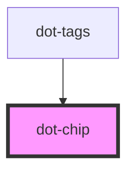

# dot-chip

<!-- Auto Generated Below -->

## Properties

| Property      | Attribute      | Description                                      | Type      | Default    |
| ------------- | -------------- | ------------------------------------------------ | --------- | ---------- |
| `deleteLabel` | `delete-label` | (optional) Delete button's label                 | `string`  | `'Delete'` |
| `disabled`    | `disabled`     | (optional) If is true disabled the delete button | `boolean` | `false`    |
| `label`       | `label`        | Chip's label                                     | `string`  | `''`       |

## Events

| Event    | Description | Type                  |
| -------- | ----------- | --------------------- |
| `remove` |             | `CustomEvent<String>` |

## Dependencies

### Used by

 - [dot-tags](../..)

### Graph

----------------------------------------------

*Built with [StencilJS](https://stenciljs.com/)*
