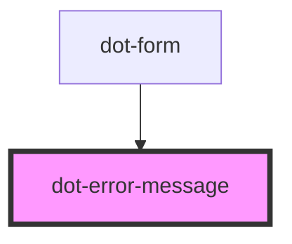

# dot-error-message

<!-- Auto Generated Below -->

## Dependencies

### Used by

 - [dot-form](../dot-form)

### Graph

----------------------------------------------

*Built with [StencilJS](https://stenciljs.com/)*
