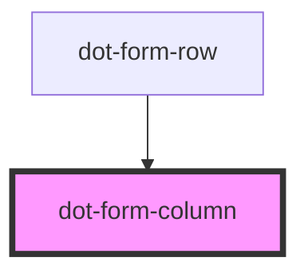

# dot-form-column

<!-- Auto Generated Below -->

## Properties

| Property       | Attribute        | Description                                                              | Type                            | Default     |
| -------------- | ---------------- | ------------------------------------------------------------------------ | ------------------------------- | ----------- |
| `column`       | --               | Fields metada to be rendered                                             | `DotCMSContentTypeLayoutColumn` | `undefined` |
| `fieldsToShow` | `fields-to-show` | (optional) List of fields (variableName) separated by comma, to be shown | `string`                        | `undefined` |

## Dependencies

### Used by

 - [dot-form-row](../dot-form-row)

### Graph

----------------------------------------------

*Built with [StencilJS](https://stenciljs.com/)*
