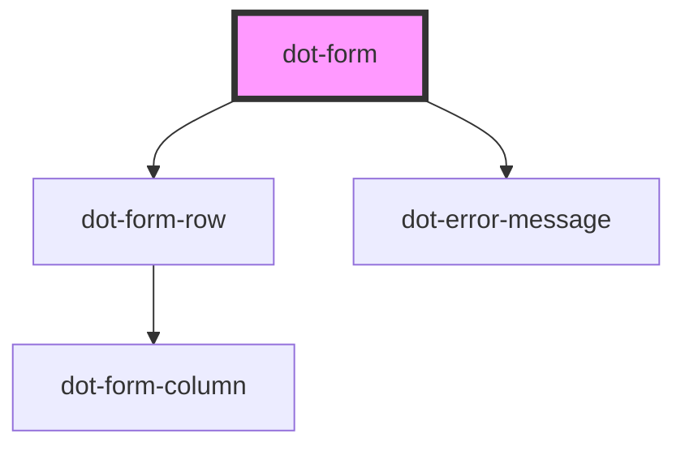

# dot-form

<!-- Auto Generated Below -->

## Properties

| Property       | Attribute        | Description                                                              | Type                           | Default     |
| -------------- | ---------------- | ------------------------------------------------------------------------ | ------------------------------ | ----------- |
| `fieldsToShow` | `fields-to-show` | (optional) List of fields (variableName) separated by comma, to be shown | `string`                       | `undefined` |
| `layout`       | --               | Layout metada to be rendered                                             | `DotCMSContentTypeLayoutRow[]` | `[]`        |
| `resetLabel`   | `reset-label`    | (optional) Text to be rendered on Reset button                           | `string`                       | `'Reset'`   |
| `submitLabel`  | `submit-label`   | (optional) Text to be rendered on Submit button                          | `string`                       | `'Submit'`  |
| `variable`     | `variable`       | Content type variable name                                               | `string`                       | `''`        |

## Dependencies

### Depends on

- [dot-form-row](./components/dot-form-row)
- [dot-error-message](../dot-error-message)

### Graph

----------------------------------------------

*Built with [StencilJS](https://stenciljs.com/)*
