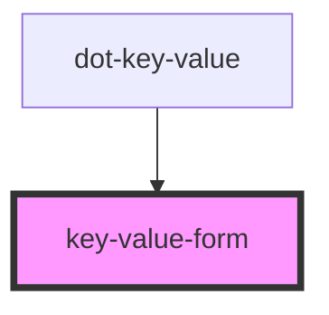

# key-value-form

<!-- Auto Generated Below -->

## Properties

| Property                   | Attribute                     | Description                                                | Type      | Default            |
| -------------------------- | ----------------------------- | ---------------------------------------------------------- | --------- | ------------------ |
| `addButtonLabel`           | `add-button-label`            | (optional) Label for the add item button                   | `string`  | `'Add'`            |
| `disabled`                 | `disabled`                    | (optional) Disables all form interaction                   | `boolean` | `false`            |
| `emptyDropdownOptionLabel` | `empty-dropdown-option-label` | (optional) Label for the empty option in white-list select | `string`  | `'Pick an option'` |
| `keyLabel`                 | `key-label`                   | (optional) The string to use in the key input label        | `string`  | `'Key'`            |
| `keyPlaceholder`           | `key-placeholder`             | (optional) Placeholder for the key input text              | `string`  | `''`               |
| `valueLabel`               | `value-label`                 | (optional) The string to use in the value input label      | `string`  | `'Value'`          |
| `valuePlaceholder`         | `value-placeholder`           | (optional) Placeholder for the value input text            | `string`  | `''`               |
| `whiteList`                | `white-list`                  | (optional) The string to use for white-list key/values     | `string`  | `''`               |

## Events

| Event        | Description                          | Type                            |
| ------------ | ------------------------------------ | ------------------------------- |
| `add`        | Emit the added value, key/value pair | `CustomEvent<DotKeyValueField>` |
| `keyChanged` | Emit when key is changed             | `CustomEvent<string>`           |
| `lostFocus`  | Emit when any of the input is blur   | `CustomEvent<FocusEvent>`       |

## Dependencies

### Used by

 - [dot-key-value](../..)

### Graph

----------------------------------------------

*Built with [StencilJS](https://stenciljs.com/)*
