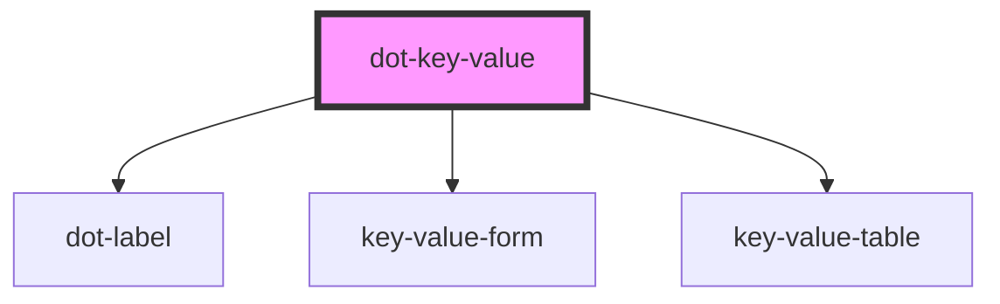

# dot-key-value

<!-- Auto Generated Below -->

## Properties

| Property               | Attribute                | Description                                                                      | Type      | Default                    |
| ---------------------- | ------------------------ | -------------------------------------------------------------------------------- | --------- | -------------------------- |
| `disabled`             | `disabled`               | (optional) Disables field's interaction                                          | `boolean` | `false`                    |
| `formAddButtonLabel`   | `form-add-button-label`  | (optional) Label for the add button in the <key-value-form>                      | `string`  | `undefined`                |
| `formKeyLabel`         | `form-key-label`         | (optional) The string to use in the key label in the <key-value-form>            | `string`  | `undefined`                |
| `formKeyPlaceholder`   | `form-key-placeholder`   | (optional) Placeholder for the key input text in the <key-value-form>            | `string`  | `undefined`                |
| `formValueLabel`       | `form-value-label`       | (optional) The string to use in the value label in the <key-value-form>          | `string`  | `undefined`                |
| `formValuePlaceholder` | `form-value-placeholder` | (optional) Placeholder for the value input text in the <key-value-form>          | `string`  | `undefined`                |
| `hint`                 | `hint`                   | (optional) Hint text that suggest a clue of the field                            | `string`  | `''`                       |
| `label`                | `label`                  | (optional) Text to be rendered next to input field                               | `string`  | `''`                       |
| `listDeleteLabel`      | `list-delete-label`      | (optional) The string to use in the delete button of a key/value item            | `string`  | `undefined`                |
| `name`                 | `name`                   | Name that will be used as ID                                                     | `string`  | `''`                       |
| `required`             | `required`               | (optional) Determine if it is mandatory                                          | `boolean` | `false`                    |
| `requiredMessage`      | `required-message`       | (optional) Text that will be shown when required is set and condition is not met | `string`  | `'This field is required'` |
| `value`                | `value`                  | Value of the field                                                               | `string`  | `''`                       |

## Events

| Event             | Description | Type                               |
| ----------------- | ----------- | ---------------------------------- |
| `dotStatusChange` |             | `CustomEvent<DotFieldStatusEvent>` |
| `dotValueChange`  |             | `CustomEvent<DotFieldValueEvent>`  |

## Methods

### `reset() => Promise<void>`

Reset properties of the field, clear value and emit events.

#### Returns

Type: `Promise<void>`

## Dependencies

### Depends on

- [dot-label](../dot-label)
- [key-value-form](./components/key-value-form)
- [key-value-table](./components/key-value-table)

### Graph

----------------------------------------------

*Built with [StencilJS](https://stenciljs.com/)*
