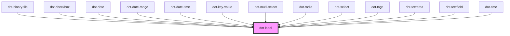

# dot-label

<!-- Auto Generated Below -->

## Properties

| Property   | Attribute  | Description                             | Type      | Default |
| ---------- | ---------- | --------------------------------------- | --------- | ------- |
| `label`    | `label`    | (optional) Text to be rendered          | `string`  | `''`    |
| `name`     | `name`     | (optional) Field name                   | `string`  | `''`    |
| `required` | `required` | (optional) Determine if it is mandatory | `boolean` | `false` |

## Dependencies

### Used by

 - [dot-binary-file](../dot-binary-file)
 - [dot-checkbox](../dot-checkbox)
 - [dot-date](../dot-date)
 - [dot-date-range](../dot-date-range)
 - [dot-date-time](../dot-date-time)
 - [dot-key-value](../dot-key-value)
 - [dot-multi-select](../dot-multi-select)
 - [dot-radio](../dot-radio)
 - [dot-select](../dot-select)
 - [dot-tags](../dot-tags)
 - [dot-textarea](../dot-textarea)
 - [dot-textfield](../dot-textfield)
 - [dot-time](../dot-time)

### Graph

----------------------------------------------

*Built with [StencilJS](https://stenciljs.com/)*
