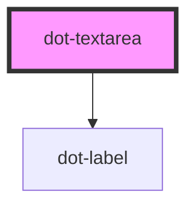

# dot-textfield

<!-- Auto Generated Below -->

## Properties

| Property            | Attribute            | Description                                                                             | Type      | Default                                                |
| ------------------- | -------------------- | --------------------------------------------------------------------------------------- | --------- | ------------------------------------------------------ |
| `disabled`          | `disabled`           | (optional) Disables field's interaction                                                 | `boolean` | `false`                                                |
| `hint`              | `hint`               | (optional) Hint text that suggest a clue of the field                                   | `string`  | `''`                                                   |
| `label`             | `label`              | (optional) Text to be rendered next to <textarea> element                               | `string`  | `''`                                                   |
| `name`              | `name`               | Name that will be used as ID                                                            | `string`  | `''`                                                   |
| `regexCheck`        | `regex-check`        | (optional) Regular expresion that is checked against the value to determine if is valid | `string`  | `''`                                                   |
| `required`          | `required`           | (optional) Determine if it is mandatory                                                 | `boolean` | `false`                                                |
| `requiredMessage`   | `required-message`   | (optional) Text that be shown when required is set and condition not met                | `string`  | `'This field is required'`                             |
| `validationMessage` | `validation-message` | (optional) Text that be shown when the Regular Expression condition not met             | `string`  | `"The field doesn't comply with the specified format"` |
| `value`             | `value`              | Value specifies the value of the <textarea> element                                     | `string`  | `''`                                                   |

## Events

| Event             | Description | Type                               |
| ----------------- | ----------- | ---------------------------------- |
| `dotStatusChange` |             | `CustomEvent<DotFieldStatusEvent>` |
| `dotValueChange`  |             | `CustomEvent<DotFieldValueEvent>`  |

## Methods

### `reset() => Promise<void>`

Reset properties of the field, clear value and emit events.

#### Returns

Type: `Promise<void>`

## Dependencies

### Depends on

- [dot-label](../dot-label)

### Graph

----------------------------------------------

*Built with [StencilJS](https://stenciljs.com/)*
