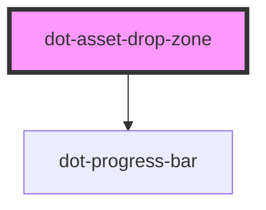

# dot-drop-zone

<!-- Auto Generated Below -->

## Properties

| Property                 | Attribute                    | Description                                                          | Type                                                                                                    | Default                                                                                                                                                |
| ------------------------ | ---------------------------- | -------------------------------------------------------------------- | ------------------------------------------------------------------------------------------------------- | ------------------------------------------------------------------------------------------------------------------------------------------------------ |
| `createAssetsText`       | `create-assets-text`         | Legend to be shown when creating dotAssets                           | `string`                                                                                                | `'Creating DotAssets'`                                                                                                                                 |
| `dialogLabels`           | --                           | Labels to be shown in error dialog                                   | `{ closeButton: string; uploadErrorHeader: string; dotAssetErrorHeader: string; errorHeader: string; }` | `{ closeButton: 'Close', uploadErrorHeader: 'Uploading File Results', dotAssetErrorHeader: '$0 of $1 uploaded file(s) failed', errorHeader: 'Error' }` |
| `displayIndicator`       | `display-indicator`          |                                                                      | `boolean`                                                                                               | `false`                                                                                                                                                |
| `dotAssetsURL`           | `dot-assets-u-r-l`           | URL to endpoint to create dotAssets                                  | `string`                                                                                                | `'/api/v1/workflow/actions/default/fire/PUBLISH'`                                                                                                      |
| `dropFilesText`          | `drop-files-text`            | Legend to be shown when dropping files                               | `string`                                                                                                | `'Drop Files to Upload'`                                                                                                                               |
| `folder`                 | `folder`                     | Specify the the folder where the dotAssets will be placed            | `string`                                                                                                | `''`                                                                                                                                                   |
| `maxFileSize`            | `max-file-size`              | Specify the max size of each file to be uploaded                     | `string`                                                                                                | `''`                                                                                                                                                   |
| `multiMaxSizeErrorLabel` | `multi-max-size-error-label` | Error to be shown when try to upload a bigger size file than allowed | `string`                                                                                                | `'One or more of the files exceeds the maximum file size'`                                                                                             |
| `singeMaxSizeErrorLabel` | `singe-max-size-error-label` | Error to be shown when try to upload a bigger size file than allowed | `string`                                                                                                | `'The file exceeds the maximum file size'`                                                                                                             |
| `uploadErrorLabel`       | `upload-error-label`         | Error to be shown when an error happened on the uploading process    | `string`                                                                                                | `'Drop action not allowed.'`                                                                                                                           |
| `uploadFileText`         | `upload-file-text`           | Legend to be shown when uploading files                              | `string`                                                                                                | `'Uploading Files...'`                                                                                                                                 |

## Events

| Event            | Description                                                  | Type                                                        |
| ---------------- | ------------------------------------------------------------ | ----------------------------------------------------------- |
| `uploadComplete` | Emit an array of Contentlets just created or array of errors | `CustomEvent<DotCMSContentlet[] \| DotHttpErrorResponse[]>` |

## Dependencies

### Depends on

-   [dot-progress-bar](../../elements/dot-progress-bar)

### Graph

---

_Built with [StencilJS](https://stenciljs.com/)_
