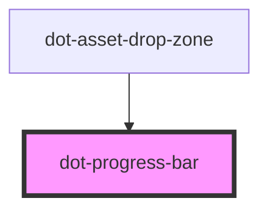

# dot-progress-bar

<!-- Auto Generated Below -->

## Properties

| Property   | Attribute  | Description                                         | Type     | Default                |
| ---------- | ---------- | --------------------------------------------------- | -------- | ---------------------- |
| `progress` | `progress` | indicates the progress to be show, a value 1 to 100 | `number` | `0`                    |
| `text`     | `text`     | text to be show bellow the progress bar             | `string` | `'Uploading Files...'` |

## Dependencies

### Used by

 - [dot-asset-drop-zone](../../components/dot-asset-drop-zone)

### Graph

----------------------------------------------

*Built with [StencilJS](https://stenciljs.com/)*
