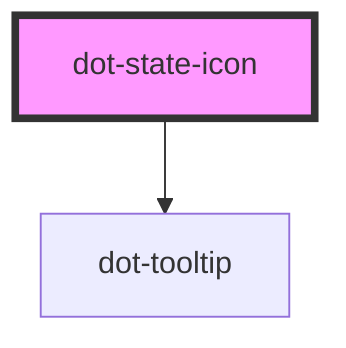

# dot-contentlet-state-icon

<!-- Auto Generated Below -->

## Properties

| Property | Attribute | Description | Type                                                                        | Default                                                                                                                      |
| -------- | --------- | ----------- | --------------------------------------------------------------------------- | ---------------------------------------------------------------------------------------------------------------------------- |
| `labels` | --        |             | `{ archived: string; published: string; revision: string; draft: string; }` | `{         archived: 'Archived',         published: 'Published',         revision: 'Revision',         draft: 'Draft'     }` |
| `size`   | `size`    |             | `string`                                                                    | `'16px'`                                                                                                                     |
| `state`  | --        |             | `DotContentState`                                                           | `null`                                                                                                                       |

## Dependencies

### Depends on

- [dot-tooltip](../dot-tooltip)

### Graph

----------------------------------------------

*Built with [StencilJS](https://stenciljs.com/)*
