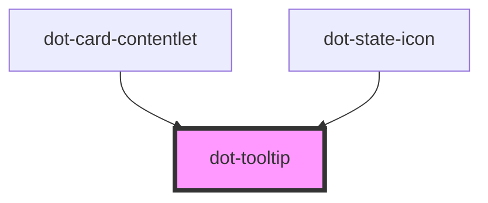

# dot-tooltip

<!-- Auto Generated Below -->

## Properties

| Property   | Attribute  | Description | Type     | Default           |
| ---------- | ---------- | ----------- | -------- | ----------------- |
| `content`  | `content`  |             | `string` | `undefined`       |
| `delay`    | `delay`    |             | `number` | `undefined`       |
| `for`      | `for`      |             | `string` | `undefined`       |
| `position` | `position` |             | `string` | `'center bottom'` |

## Dependencies

### Used by

 - [dot-card-contentlet](../../components/dot-card-contentlet)
 - [dot-state-icon](../dot-state-icon)

### Graph

----------------------------------------------

*Built with [StencilJS](https://stenciljs.com/)*
