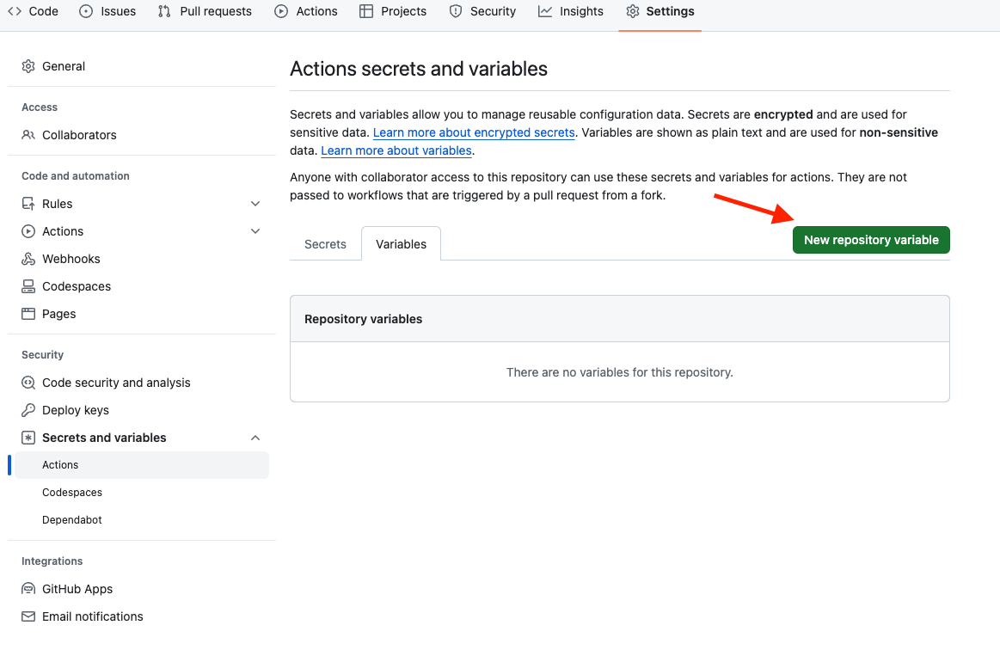
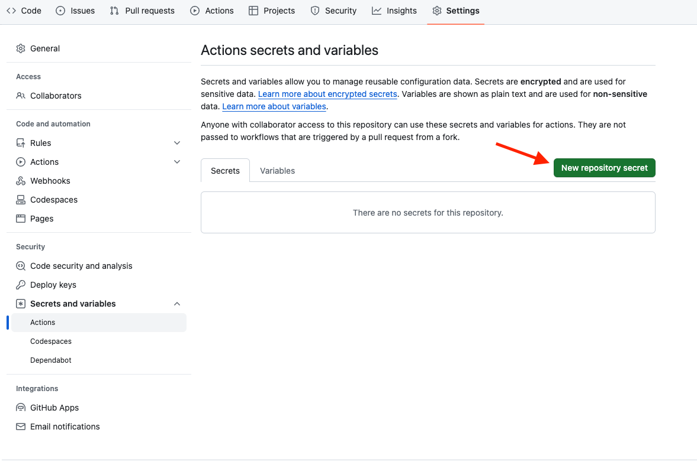

# dotCMS CLI 
The **dotCMS CLI**, sometimes shortened to **dotCLI**, is a standalone tool for interacting with a dotCMS instance through a command shell, allowing a wide array of automated operations and behaviors.

## Getting Started

### Installation

### NPM

The simplest and most recommended way to get the dotCMS CLI is from its npm package:

```shell script
npm install -g @dotcms/dotcli
```
### Manual JAR Download

1. Download the CLI: The dotCMS CLI is delivered as an uber jar that can be downloaded from [here](https://repo.dotcms.com/artifactory/libs-snapshot-local/com/dotcms/dotcms-cli/).
 Once downloaded, you just need to run it with: 

```shell script
java -jar dotcli.jar
```

2. Configure the dotCMS instances you want to connect to using the `config` command. More details on how to do it on the [Configuration](#Configuration) section. 

3. Log in to the selected instance
```shell script
java -jar dotcli.jar login --user={USER} --password  
```


## Available Commands

| Command                                    | Description                                                                         |
|--------------------------------------------|-------------------------------------------------------------------------------------|
| [config](cli/docs/config.adoc)             | Sets the initial configuration required by all commands to operate                  |
| [content-type](cli/docs/content-type.adoc) | Performs operations over content types. For example: pull, push, remove             |
| [files](cli/docs/files.adoc)               | Performs operations over files. For example: tree, ls, push                         |
| [instance](cli/docs/instance.adoc)         | Prints a list of available dotCMS instances                                         |
| [language](cli/docs/language.adoc)         | Performs operations over languages. For example: pull, push, remove                 |
| [login](cli/docs/login.adoc)               | Logs into a dotCMS instance                                                         |
| [push](cli/docs/push.adoc)                 | Global push command used to sync a GitHub repo with a target dotCMS environment     |
| [pull](cli/docs/pull.adoc)                 | Global pull command used to sync a target dotCMS environment with a local workspace |
| [site](cli/docs/site.adoc)                 | Performs operations over sites. For example: pull, push, remove                     |
| [status](cli/docs/status.adoc)             | Provides information about the current logged-in user and dotCMS instance status    |


You can find more details about how to use the dotCMS CLI in the [Examples](#examples) section.


## Examples

1. Run Configuration command to set the initial configuration required by all commands to operate
```shell script
config 
Enter the key/name that will serve to identify the dotCMS instance (must be unique) [local].
The name is [local]
Enter the dotCMS base URL (must be a valid URL starting protocol http or https) [http://localhost:8080]
The URL is [http://localhost:8080]
Are these values OK? (Enter to confirm or N to cancel)  (Y/n)
...
Do you want to continue adding another dotCMS instance?  (Y/n)n
 0. Profile [local], Uri [http://localhost:8080], active [no].
 1. Profile [local#1], Uri [https://demo.dotcms.com], active [no].
One of these profiles needs to be made the current active one. Please select the number of the profile you want to activate. 1
```
2. Log in with an admin user
```shell script
login --user=admin@dotCMS.com --password
```
2. List and choose the dotCMS instance we want to run against
```shell script
instance --list
```
3. Activate a dotCMS instance profile called `demo`
```shell script
instance --activate demo
```
4. Get info of the current instance running
```shell

status
	
#You will get an output similar to:
2023-02-22 11:25:29,499 INFO  [com.dot.api.cli.HybridServiceManagerImpl] (Quarkus Main Thread) Service [default] is missing credentials.
2023-02-22 11:25:29,500 INFO  [com.dot.api.cli.HybridServiceManagerImpl] (Quarkus Main Thread) Service [demo] is missing credentials.
Active instance is [demo] API is [https://demo.dotcms.com/api] No active user Use login Command.
```

5. Pull a content type
```shell script
content-type pull FileAsset
```
6. Create a new site
```shell script
site create "my.cool.bikes.site.com"
```

## Building the CLI (dev mode)

The CLI is a quarkus/pico-cli project made up of two modules [cli](cli) and [api-data-module](api-data-model).
This project acts as a maven reactor pom build. You can build at the top level to build the modules.

```shell script
./mvnw clean install -DskipTests=true
```

We suggest to build the project ignoring test execution (`-DskipTests=true`). It will run faster and avoid setting up a testing environment.

#### Running the CLI (dev mode)

You might use [quarkus cli](https://es.quarkus.io/guides/cli-tooling) or [maven](https://maven.apache.org/install.html)
First, start a dotCMS instance locally. 
Then, execute the following commands

```shell script
# from top level to build all
cd cli
# command is same as the following to run the quarkus build plugin
# ../mvnw quarkus:dev 
quarkus dev
```
**NOTE:**  To reduce duplication in the multi-module project, mvnw is not included on each submodule.
The quarkus command finds the executable

To run mvnw from a submodule just use a relative path to the parent mvn.
If running from a submodule folder, all the dependencies will need to be up to date and installed to the local mvn with maven install

Alternatively, you can specify the subproject from the parent folder
```shell script
# from top level to build all
cd cli
# The command is same as the following to run the quarkus build plugin
# ../mvnw quarkus:dev 
../mvnw -pl cli quarkus:dev
```

Once the cli is launched in dev mode it'll print out a list of available commands.

followed by 

```shell script
--
Tests paused
Press [space] to restart, [e] to edit command line args (currently ''), [r] to resume testing, [o] Toggle test output, [:] for the terminal, [h] for more options>
```

We can also instruct Quarkus dev mode to launch our cli using a preconfigured param by doing:
```shell script
../mvn quarkus:dev -Dquarkus.args=status
```
This will launch the cli passing directly into it the arguments that tell them to execute the command status.

## Building a CLI jar 
In order to generate the cli as a jar packaged with all necessary dependencies you need to run the following command from the `cli` directory:
```shell script
../mvnw clean install package
```

All the commands can be executed directly from the generated jar which can be found under `cli/target/quarkus-app/`.

Example:
```shell script
java -jar ./cli/target/quarkus-app/quarkus-run.jar status
```

## Logging

When running the CLI, a **_dotcms-cli.log_** file will be created in the directory where the CLI
executable is run.

#### File log level

To increase the file log level to _DEBUG_ when running in dev mode, use the following command:

```shell
../mvnw quarkus:dev -Dquarkus.log.file.level=DEBUG
```

#### Console log level

To increase the console log level to _DEBUG_ when running in dev mode, use the following command:

```shell
../mvnw quarkus:dev -Dquarkus.log.handler.console.\"DOTCMS_CONSOLE\".level=DEBUG
```

#### File log location

To override the default location of the log file, you have two options:

##### 1. Set the environment variable

Example:

```shell
export QUARKUS_LOG_FILE_PATH=/Users/my-user/CLI/dotcms-cli.log
java -jar cli-1.0.0-SNAPSHOT-runner.jar login -u admin@dotcms.com -p
```

##### 2. Set the system property

Example:

```shell
../mvnw quarkus:dev -Dquarkus.log.file.path=/Users/my-user/CLI/dotcms-cli.log
```

## Configuration

The CLI can be used to manage multiple dotCMS instances. Each instance profile is defined in the `~/.dotcms/dot-service.yml` file. 
Whatever profile is active will be used by the CLI to execute the commands on
The selected profile can be obtained by running the `status` command.
Here's an example of the default `dot-service.yml` file shipped with the CLI:

```yaml
- name: "default"
  url: "http://localhost:8080"
  credentials:
    user: "admin@dotcms.com"
- name: "demo"
  url: "https://demo.dotcms.com"
  active: true
  credentials:
    user: "admin@dotCMS.com"
```

Therefore, in order to add a new instance profile, you need to add a new entry in the `dot-service.yml` as it is shown on the example above.
The `active` attribute indicates which profile is currently active. The CLI will use the active profile to execute the commands. 
If more than one profile is marked active, this will result in an InvalidStateException.
The `credentials` section is optional. If the credentials are not provided, the CLI will prompt the user to enter them when the `login` command is executed.

If the `dot-service.yml` file does not exist, the CLI will prompt to create one No commands can operate without having a valid configuration in place.

The CLI provides a `config` command to set the initial configuration required by all commands to operate. The command will guide you through the process of adding a new instance profile to the `dot-service.yml` file. and setting the active profile.
See the [Configuration](cli/docs/config.adoc) section for more details. And the [Examples](#examples) section for a practical example.


### Workspace

The CLI needs a workspace to be able to pull and push content to a dotCMS instance. 
The workspace is basically a set of directories and files used to house and organize the different type of assets that can be managed by the CLI.
Additionally, a marker file called `.dot-workspace.yml` indicates to the CLI that the current directory is a valid workspace.
In the following table you can see the different directories and files that conform a workspace.


| File/Directory       | Type | Description             |
|----------------------|------|-------------------------|
| `content-types/`     | Dir  | Content-Types directory |
| `files/`             | Dir  | Files directory         |
| `languages/`         | Dir  | Languages Directory     |
| `sites/`             | Dir  | Sites Directory         |
| `.dot-workspace.yml` | File | CLI workspace marker    |

## GitHub Actions Integration
We provide support for GitHub Actions to be able to run the CLI as part of your CI/CD pipeline. 

The following example shows how to create a brand-new repository and seed it with a CLI workspace.
In order to incorporate the CLI into your GitHub Actions workflow, you need to:

- Create a GitHub Repository to manage your dotCMS assets.
- Copy the contents of the [action](./action) directory into your root project `.github/workflows` directory.
- In Your repository General Settings, enable the following permissions:
  -  Workflow Permissions : Read and Write permissions 
- In Your repository General Settings, Secrets and variables, Actions
  - Create a new variable called `DOT_API_URL` and set the value to a valid dotCMS URL. e.g. `https://demo.dotcms.com`
  
  - Create a new secret called `DOT_TOKEN` and set the value to a valid dotCMS CLI token. 
  
-  Seed your local repository with a CLI workspace
    * A cli workspace can be created by running any pull command e.g. `java -jar dotcli.jar files pull //demo.dotcms.com`  
    * Run any pull command from the root of your project see [examples](#examples) section.
    * A valid CLI workspace should contain a `.dot-workspace` file in the root of your project. Make sure to commit this file to your repository and the others that conform your workspace see the [workspace](#workspace) section. 
    * Commit and push the changes to your repository. 

- Now if the integration is successful, you should see a new commits made into your repository reflect in you dotCMS instance.

Here's an example of how a Git repository could look like after the GitHub Action has been integrated:

| File/Directory       | Type | Description               |
|----------------------|------|---------------------------|
| `.github/workflows/` | Dir  | GitHub Actions workflow   |
| `content-types/`     | Dir  | Content-Types directory   |
| `files/`             | Dir  | Files directory           |
| `languages/`         | Dir  | Languages Directory       |
| `sites/`             | Dir  | Sites Directory           |
| `.dot-workspace.yml` | File | CLI workspace marker      |
| `.gitignore`         | File | Git files exclude         |
| `README.md`          | File | Project readme            |
| `.env`               | File | Push command Options Spec |

- The default command executed by our GitHub Action is the global `push` 
- Global Push has different options. For more details to control the execution of the command see [Global Push](cli/docs/push.adoc) section for more details.
- Any additional Options required by the Global push command can be specified in the `.env` file in the following format `DOT_CLI_OPTS="--option1 --option2"`
So a valid example of a `.env` file could look like this `DOT_CLI_OPTS="--force --dry-run"`
```shell script
   DOT_CLI_OPTS=" --removeAssets --removeFolders --removeSites --removeContentTypes --removeLanguages --errors"
```
These options can cause data loss, so use them with caution. That's why they are not enabled by default.
Do not enable them unless you know what you are doing.
