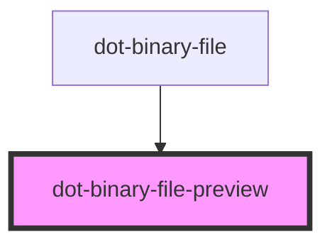

# dot-binary-file-preview

<!-- Auto Generated Below -->

## Properties

| Property      | Attribute      | Description                         | Type     | Default    |
| ------------- | -------------- | ----------------------------------- | -------- | ---------- |
| `deleteLabel` | `delete-label` | (optional) Delete button's label    | `string` | `'Delete'` |
| `fileName`    | `file-name`    | file name to be displayed           | `string` | `''`       |
| `previewUrl`  | `preview-url`  | (optional) file URL to be displayed | `string` | `''`       |

## Events

| Event    | Description                   | Type               |
| -------- | ----------------------------- | ------------------ |
| `delete` | Emit when the file is deleted | `CustomEvent<any>` |

## Dependencies

### Used by

 - [dot-binary-file](../dot-binary-file)

### Graph

----------------------------------------------

*Built with [StencilJS](https://stenciljs.com/)*
